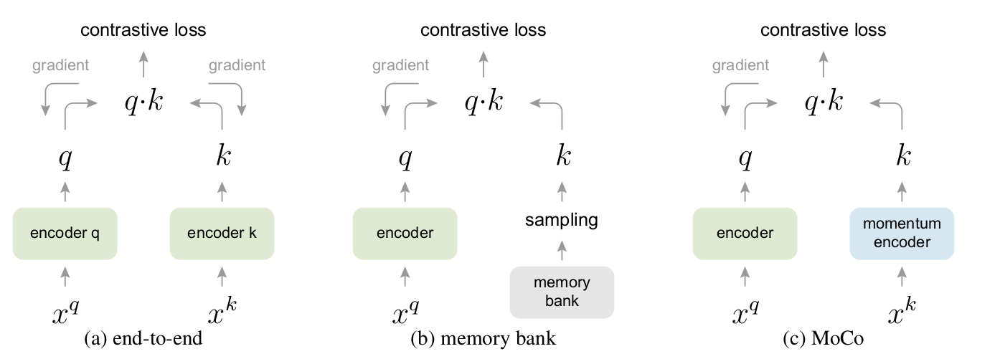
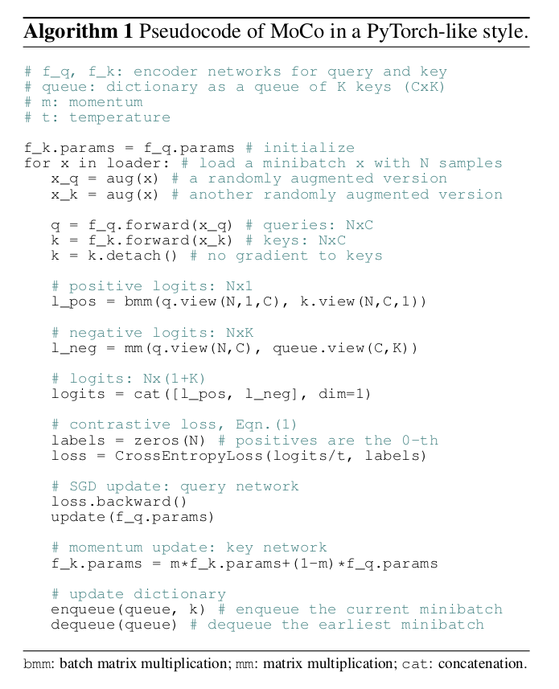
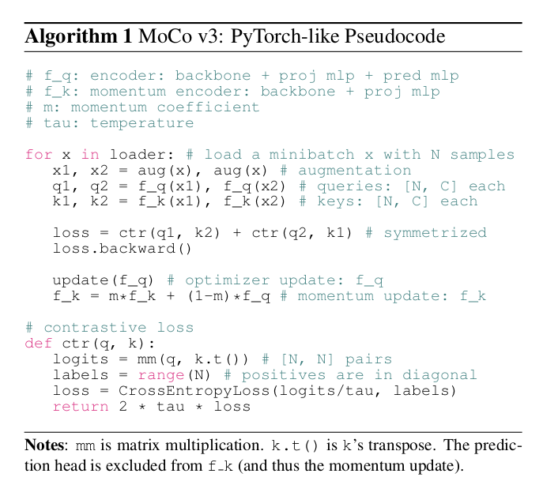

# MoCo

> 文章标题：[Momentum Contrast for Unsupervised Visual Representation Learning](https://arxiv.org/abs/1911.05722) 
>
> 作者：[Kaiming He,](https://kaiminghe.github.io/) [Haoqi Fan,](https://haoqifan.github.io/) [Yuxin Wu](https://ppwwyyxx.com/), [Saining Xie](https://www.sainingxie.com/), [Ross Girshick](https://scholar.google.com/citations?hl=en&user=W8VIEZgAAAAJ&pagesize=1000&sortby=pubdate)
>
> 发表时间：(CVPR 2020)
>
> [offical code](https://github.com/facebookresearch/moco)
>
> 视觉 + 对比学习的里程碑式的工作

**无监督学习的目的**：在一个很大的无标注的数据集上训练，模型学到的特征可以很好的迁移到下游任务。

**对比学习**：通过对比去学习模型，只需要知道图 A和 图 B相似，图 A、图 B和 图 C不相似；而不需要真的知道各个图片的具体类别。

> 3 张图进入一个网络 M 得到特征 f1、f2、f3，在一个学习好的特征空间 embedding space 中，f1、f2 的特征尽量近，和 f3 的特征尽量远离。
>
> 对比学习学到的很好的特征：类似物体在这个特征空间 **相邻**，不类似的物体在特征空间 **远离**

**Q: 图 1 和 图 2 相似，和图 3 都不相似，难道不是有监督学习吗？Why 对比学习在 CV 领域被认为是无监督训练呢？**

CV 领域 设计巧妙的代理任务 pre-text task，人为设立一些规则 —— 定义哪些图片相似、哪些图片不相似，为自监督学习提供监督信号，从而自监督训练

一个无标注的数据集，n 张图片，$x_1, x_2, ..., x_n$， 随机选取一张图片，做 transformation。

以 $x_1 $图片为例，$x_1 $随机裁剪 + 数据增广 得到 $x_i^1$, $x_i^2 $（看起来和 $x_1$ 有区别的 2 张照片， $x_1$ 的正样本），数据集中的其它图片 $x_j$,  $j ≠ i $是 $x_1$ 的负样本

> 基于图片和图片本身的变换是正样本，和其它图片是负样本
>
> ImageNet-1K 此时不是 1000 个类别，而是 100w 个类别。每个图片都是它自己的正样本，其余都是负样本。

对比学习的框架：灵活性--定义正负样本的规则

- 同一个视频里的任意两帧是正样本，和其它视频的所有帧是负样本
- NLP, simCSE 把同样的句子扔给模型，但是做 2 次 forward，通过不同的 dropout 得到一个句子的 2 个特征；和其它所有句子的特征都是负样本。
- CMC 论文：一个物体的不同视角 view（正面、背面；RGB 图像、深度图像）作为不同形式的正样本。
- 多模态领域：Open AI 的 CLIP 模型

## MoCo标题

> Momentum Contrast for Unsupervised Visual Representation Learning 
>
> 动量对比学习的方法做无监督视觉特征学习

Momentum Contrast: 动量对比学习

> 动量：(指数)加权移动平均值 $y_t = m * y_{t-1} + (1 - m) * x_t$
>
> * m: 动量的超参数
>
> * $y_{t-1}$: 上一个时刻的输出
>
> * $x_t$:  当前时刻的输入
>
> * m 趋近于 1，$y_t $改变缓慢，当前时刻的输入 $x_t $没什么影响
>
> * m 趋近于 0, $y_t $更多依赖于当前时刻的输入。
>
> MoCo 利用动量的特性，缓慢的更新一个编码器，从而让中间学习到的字典中的特征尽可能保持一致。

**MoCo 从什么角度做对比学习呢？**

**dictionary look-up**, 字典查询任务, a dynamic dictionary with a queue and a moving-averaged encoder 动态字典

- **一个队列**：队列中的样本**无需梯度回传**，可以放很多负样本，让字典变得很大
- **一个移动平均的编码器**：让字典的特征尽可能的保持一致
- 一个大的、一致的字典，有利于无监督的对比学习训练。

## Introduction

**NLP 的离散单词更具语义性，CV的连续、高维信号不好构建字典**

无监督在 CV 不成功的原因是什么？

- 原始信号空间的不同

- NLP 原始信号是离散的，词、词根、词缀，容易构建 tokenized dictionaries 做无监督学习

  > tokenized: 把一个词对应成某一个特征
  >
  > Why tokenized dictionaries 有助于无监督学习？
  >
  > * 把字典的 key 认为是一个类别，有类似标签的信息帮助学习
  > * NLP 无监督学习很容易建模，建好的模型也好优化
  > * CV 原始信号是连续的、高维的，不像单词具有浓缩好的、简洁的语义信息，不适合构建一个字典
  > * 如果没有字典，无监督学习很难建模

**给CV 无监督对比学习 构建一个 ==大 (by queue)==+ ==一致 (momentum encoder)==的字典**

$f_{11} $当成 query 在 $f_{12}, f_2, f_3, ..., f_n$ 组成的字典的 key 特征条目 $k_1, k_2, ...$ 里面查找，dictionary look-up 靠近 $f_{12}$, 远离 $f_2, f_3, ...$

从动态字典的角度看对比学习，什么样的字典才适合呢？ **大 + 一致性**

> large 
>
> > 从连续高维空间做更多的采样。字典 key 越多，表示的视觉信息越丰富，匹配时更容易找到具有区分性的本质特征。
> >
> > 如果 字典小、key 少，模型可能学到 shortcut 捷径，不能泛化
>
> consistent 
>
> > 字典里的 key ($k_0, k_1, k_2, ..., k_N$) 应该由相同的 or 相似的编码器生成
> >
> > 如果字典的 key 是由不同的编码器得到的，query q 做字典查询时，很有可能 找到和 query 使用同一个 or 相似编码器生成的 key，而不是语义相似的 key。另一种形式的 shortcut solution

## Related work

两个可以做的点：pretext tasks and loss functions

- **代理任务**：为了学习一个好的数据特征表示
- **损失函数**：和代理任务可以分开研究。 MoCo 的创新点在损失函数，又大又一致的字典 影响 infoNCE 目标函数的计算

**损失函数：判别式、生成式、对比学习、对抗学习**

> 对比学习的损失：目标不固定，训练过程中不断改变。目标有编码器抽出来的特征（MoCo 的字典）而决定
>
> 判别式：预测 8 个位置中的哪一个方位（九宫格）
>
> 生成式：重建整张图
>
> 对比学习的目标：测量样本对 在特征空间的相似性。相似样本离得近，不相似样本离得远
>
> 对抗学习的目标：衡量两个概率分布之间的差异

对比学习和代理任务的关系：

- 不同的代理任务 可以和 某种形式的对比学习的目标函数 配对使用
- Instance discrimination 个体判别方法  -----   examplar based 代理任务很相关
- CPC contrastive predictive coding 用上下文信息预测未来  -----  context auto-encoding 上下文自编码
- CMC contrastive multiview coding 利用一个物体的不同视角做对比 -----  olorization 图片上色（同一个图片的 2 个视角：黑白 和 彩色）

## Methods

对比学习和最近的发展，都可以看成是一个训练一个 encoder 来做 字典查询 的任务

损失函数[InfoNCE](https://arxiv.org/abs/1807.03748)形式：
$$
L_q=-log\ \frac{exp(q\cdot k_+ / \tau)}{\sum_{i=0}^K exp(q\cdot k_i / \tau)}
$$

>  *q* : 编码查询,;$\{k_0, k_1, k_2, ...\}$: 一组键 *key* 编码样本 。假设字典中只有一个键$（k_+）$与 *q* 匹配。
>
> $\tau$: 温度超参数； K : 负样本个数。
>
> 试图将 q 分类为 k+ 的 (K+1)-way softmax-based 分类器的对数损失。

    
     
    
MoCo 框架图
    

> end to end: 编码器都能通过反向传播实时更新学习。（特征高度一致）
>
> > 局限性：字典大小 == mini-batch size 硬件限制；大 batch size 优化难，难收敛
>
> memory bank: 只有query 编码器可以进行梯度回传更新。 把所有特征存在memory bank里， 从memory bank中随机抽取 key 当作字典；没有反向传播，所以它可以支持大的字典大小。
>
> > 局限性：不同时刻编码器(梯度回传更新)得到的特征缺乏一致性
>
> MoCo: 采用队列形式实现一个字典（ 不受batch size限制 ），使用动量编码器（提高一致性）

**queue** 数据结构:   剥离字典的大小 和 显卡内存的限制，让字典的大小和模型每次做前向传播的 batch size 的大小分开

> 当前 mini-batch 入队，最早进入队列的 mini-batch 出队
>
> 队列的大小 == 字典的大小，但是每次做 iteration 更新，并不需要更新字典中所有 key 元素的值。

**momentum encoder**：使用 queue，只有当前 mini-batch 的特征是由当前的编码器得到的；之前的 key 是由不同时刻的编码器抽取的特征，如何保持 consistent 呢？

> momentum encoder 由当前时刻的 encoder 初始化而来	
>
> $\theta_k = m * \theta_{k-1}+ (1-m) * \theta_q$
>
> > 动量系数: $m\in[0,1)$。只有参数 θq 通过反向传播更新。 
> >
> > 动量参数 m 较大时，$\theta_k $的更新缓慢，不过多的依赖于 $\theta_q $当前时刻的编码器，即不随着当前时刻的编码器快速改变，尽可能保证 字典里的 key 都是由相似的编码器生成的特征，保证特征的 consistent

    
     
    
MoCo pytorch 算法
    

**Shuffling BN**  

> 小 trick ,后续没再用

BN会阻止模型学习好的表征，可能是由于样本中间的信息（由BN引起）泄露。

操作：配给GPU之前打乱样本顺序，用多个GPU进行训练，并对每个GPU的样本独立进行BN。再把顺序恢复后算loss。

## 拓展阅读

[MoCo 论文逐段精读【论文精读】](https://www.bilibili.com/video/BV1C3411s7t9/?vd_source=d28e92983881d85b633a5acf8e46efaa)

# MoCo-V2

> 文章标题：[Improved Baselines with Momentum Contrastive Learning](https://arxiv.org/abs/2003.04297) 
>
> 作者: [Xinlei Chen](https://xinleic.xyz/),  [Haoqi Fan,](https://haoqifan.github.io/)  [Ross Girshick](https://scholar.google.com/citations?hl=en&user=W8VIEZgAAAAJ&pagesize=1000&sortby=pubdate), [Kaiming He](https://kaiminghe.github.io/) 
>
> 发表时间: (Arxiv 2021) 技术报告 (2页)

MoCo v2发现SimCLR里的那些技术都是即插即用型的，引入了mlp projection head以及使用更多的数据增强，就又刷新ImageNet 上的最好成绩。

> 加了一个 mlp 层
>
> > 没有  batch norm ；直接 fc + Relu + fc + Relu
>
> 加了更多的数据增强
>
> 训练的时候用了cosine的 learning rate schedule
>
> 训练更长的 epoch，从200变到了800

# MoCo-V3

> 文章标题：[An Empirical Study of Training Self-Supervised Vision Transformers](https://arxiv.org/abs/2104.02057)  
>
> 作者:  [Xinlei Chen](https://xinleic.xyz/), Saining Xie, [Kaiming He](https://kaiminghe.github.io/) 
>
> 发表时间: (ICCV 2021)
>
> MoCo v2 + SimSiam
>
> [offical code](https://github.com/facebookresearch/moco-v3)

    
     
    
MoCoV3 pytorch 算法
    

残差网络换成 ViT

> 当这个  batch size  变大了以后曲线会抖动，效果变差
>  方法：观察了一下训练时，每一层这个回传梯度的情况；发现每次 loss 有大幅震动
> 导致这个准确度大幅下降的时候，梯度也会有一个波峰（发生在第一层）
>
> 第一层：patch projection
> 解决：随机初始化了一个 patch projection 层；然后冻结使得整个训练过程中都不变
