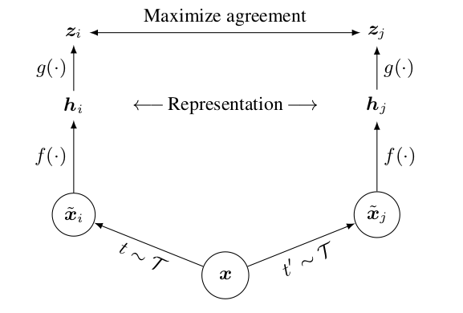
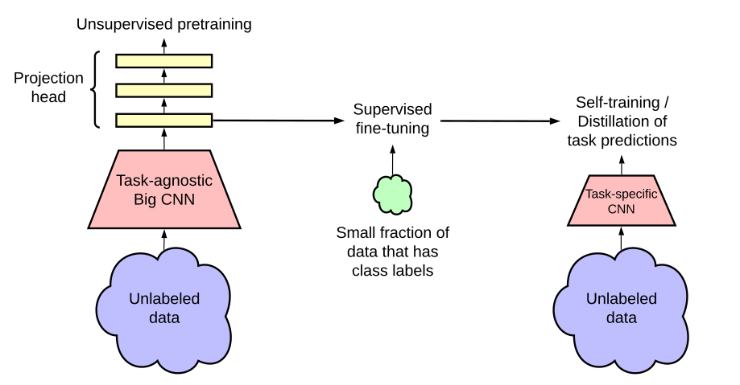

# SimCLR-V1

> 文章标题：[A Simple Framework for Contrastive Learning of Visual Representations](https://arxiv.org/abs/2002.05709) 
>
> 作者：Ting Chen, Simon Kornblith, Mohammad Norouzi, Geoffrey Hinton
>
> 发表时间：(ICML 2020)
>
> [offical code](https://github.com/google-research/simclr)

    
     
    
SimCLR V1
    

- 如果有一个mini-batch的图片 x，对 x 做不同的数据增强就会得到 $\hat x_i$ 和 $\hat x_j$

  > 一个图片延伸得到的两个图片就是正样本，如果batch size是N的话，正样本个数就是N，负样本的个数就是这个 batch size 剩下所有的样本以及它们数据增强过后的样本是 $2\times (N - 1)$     (和[InvaSpread](https://arxiv.org/abs/1904.03436)一样)

- 通过编码器 $f$ 进行编码(共享权重)，得到的 $h$  (特征表示）是2048维

- SimCLR的重大创新点

- > 在特征之后又加了一个projector，也就是上图中的 $g$ 函数，它就是一个mlp层（fc 层+ Relu），变成128维
  >
  > > 让最后学到的特征在ImageNet 这个分类任务上直接提点将近10个点
  > >
  > > 不论是32、64还是2048其实都没太大区别

- 衡量一下正样本之间是不是能达到最大的一致性，采用的是normalized temperature-scaled的交叉熵函数。

  > normalized：特征后面进行了 L2 归一化，temperature-scaled  ：温度超参数

- $g$ 函数只有在训练的时候才用，只用$h$这个特征去做下游任务

SimCLR和InvaSpread区别

> 用了更多的数据增强
>
> > 从最开始的原始图片，到裁剪，到改变色彩，到旋转，使用 cutout，使用高斯的噪声和高斯 blur，以及最后使用sobel滤波器
> >
> > 进行了消融实验发现最有效的两个数据增强就是**随机裁剪**和**随机色彩变换**
>
> 加了一个$g$函数（一个可以学习的分线性的变换，就是一个 mlp层）
>
> 用了更大的batch size ，而且训练的时间更久

# SimCLR-V2

> 文章标题：[Big Self-Supervised Models are Strong Semi-Supervised Learners](https://arxiv.org/abs/2006.10029) 
>
> 作者：Ting Chen, Simon Kornblith, Kevin Swersky, Mohammad Norouzi, Geoffrey Hinton
>
> 发表时间：(NIPS 2020)

    
     
    
模型总览图
    

> 使用了更大的模型，换了一个152层的残差网络，同时用了这个selective kernels，也就是SKNet
>
> 加深了V1里的projection head：，原来是 fc + relu，现在是 fc + relu + fc + relu
>
> 引入了MoCo的动量编码器
