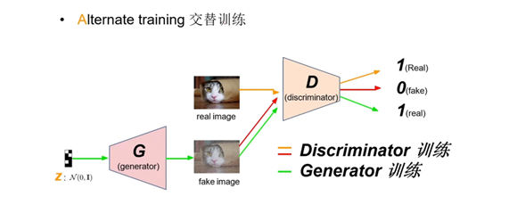
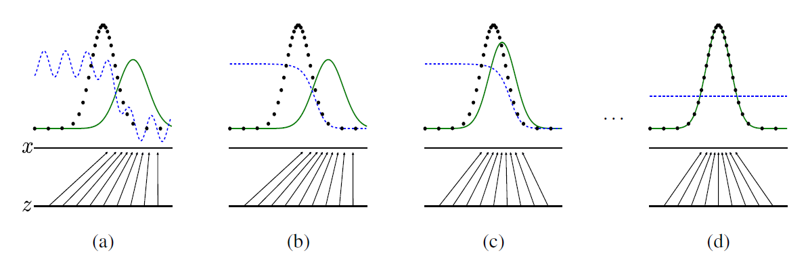
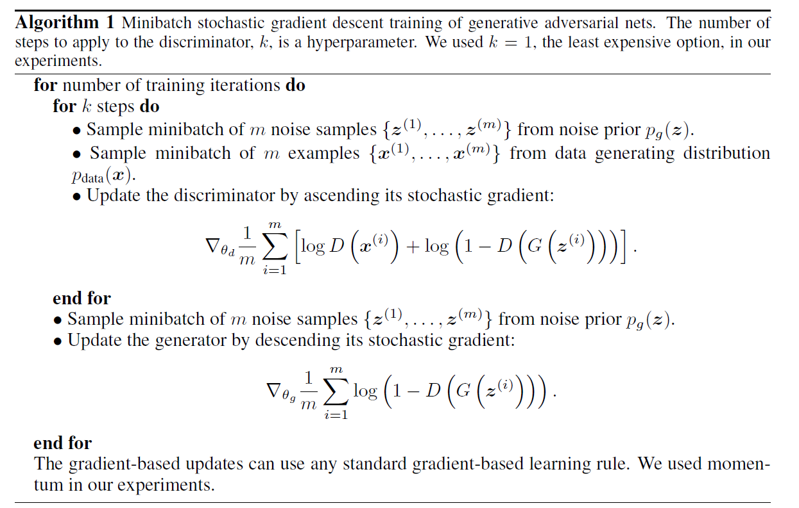
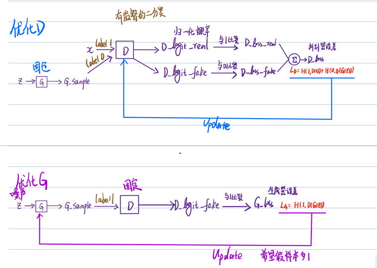
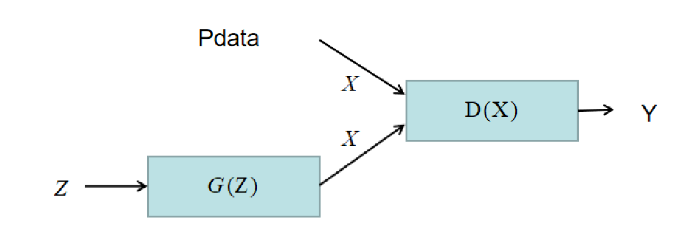

# GAN

> 文章标题：[Generative Adversarial Networks](https://arxiv.org/abs/1406.2661)
> 作者：Ian J. Goodfellow, Jean Pouget-Abadie, Mehdi Mirza, Bing Xu, David Warde-Farley, Sherjil Ozair,
>
> Aaron Courville, Yoshua Bengio
>
> 发表时间：(NIPS  2014）
>
> [官方代码](https://github.com/goodfeli/adversarial)

——Learnable cost function损失函数时从数据学习得到的

——Mini-Max game based on Nash Equilibrium 博弈论

——Hard to training -no guarantee to equilibrium

 

GAN

 

GAN理论

> **噪音 z 一维标量 （均匀分布采样得来），数据 x 也是 一维标量（图中黑点，高斯分布）。**
>
> **G对噪声z的映射**
>
> **D对噪声z的映射到数据空间的判断线**
>
> > （a）：G 把 均匀分布采样得到的噪声 z 映射到 绿色高斯分布
> > （b）：D 尽可能地去学习如何判断
> >
> > > 真实数据均值更靠左，将左侧的数据判断为真 1， 将右侧数据判断为假 0
> >
> > （c）：G 尽可能地去糊弄 D，把高斯分布的均值中心往左挪动
> > （d）：G 把 来自均匀分布的噪声，映射成和真实 data x 相似的高斯分布。D 对来自真实采样的数据 or G 生成的数据无法判断来源，概率都是 0.5

Step1：Fix generator G , and update discriminator D.

​       训练D：D learns to assign high scores to real objects and low scores to generated objects.（提高判断力，分辨真假，生成数据为假）

Step2：Fix discriminator D, and update generator G .

​       训练G：G learns to“fool”the discriminator.（提高造假能力，改进生成数据，使其接近真实数据）

<table border="0">
<tr>
  <td align="center"></td>  
  <td align="center"></td>
</tr>
<tr >
        <td  align="center" style="color:orange; border-bottom: 1px solid #d9d9d9;color: #999;
padding: 2px;">GAN_Alogorithm</td>
  <td   align="center" style="color:orange; border-bottom: 1px solid #d9d9d9;color: #999;
padding: 2px;">流程</td>
</tr>
</table>

> k 不能太小 --> 保证 判别器 D 有足够的更新
> k 不能太大 --> D 过于完美，$D(G(z^{x(i)}) = 0$，对值为 0 求导，G 梯度更新有困难
> k 的设计目标：使得 D 和 G 的更新进度差不多

## 全局最优解证明

 

GAN

$P_{data}$：$\{x_i\}_{i=1}^N$

$P_g(x;\theta_g)$：generator，$G(z;\theta_g)$

$y|x$：discriminater，$P(y=1|x)=D(x)$，$P(y=0|x)=1-D(x)$

$G(z;\theta_g)$和$D(x;\theta_d)$是两个多层感知机。GAN就是这样采用对抗学习，其最终目的就是$P_g = P_{data}$。目标函数中，记：
$$
\begin{equation}

​    V(D,G) = \mathbb{E}_{x\sim P_{data}}[\log D(x)] + \mathbb{E}_{x\sim P_{z}}[\log (1-D(G(z)))]

\end{equation}
$$
最终的目标是令$P_g = P_{data}$​，而$P_g $​中的参数为$\theta_g$​。在之前的极大似然估计思想中，
$$
\begin{equation}

​    \theta_g = \arg\max_{\theta_g} \sum_{i=1}^N \log P_g(x_i)

\end{equation}
$$
而对$P_g(x_i)$比较复杂，通常采用EM算法和VI来进行近似，通过推导可以得出，最后的目标为：
$$
\arg\min_{\theta_g} \text{KL}(P_{data}\|P_g)
$$

For fixed G，求解$\max_D V(G,D)$
$$
\begin{equation}

​    \begin{split}

​        \max_D V(D,G) = & \int P_{\text{data}} \log D dx + \int P_g \log(1-D) dx \\

​        =& \int (P_{\text{data}} \log D  + P_g \log(1-D)) dx

​    \end{split}

\end{equation}
$$

通过求偏导来计算最优解：
$$
\begin{equation}

​    \begin{split}

​        \frac{\partial  \max_D V(D,G)}{\partial D} = & \frac{\partial}{\partial D} \int \left[ P_{\text{data}} \log D  + P_g \log(1-D) \right]dx \\

​        = &  \int \frac{\partial}{\partial D} \left[ P_{\text{data}} \log D  + P_g \log(1-D) \right]dx \\
         = & \int P_{\text{data} }\cdot \frac{1}{D} + P_g \frac{-1}{1-D} dx \\

​        = & 0 \\

​    \end{split}

\end{equation}
$$
恒成立，所以有：
$$
\begin{equation}

​    D_G^\ast = \frac{P_{\text{data}}}{P_{\text{data}} + P_{g}}

\end{equation}
$$
第二步，将$  D_G^\ast$代入求解的是：
$$
\begin{equation}

​    \begin{split}

​        \min_G \max_D V(D,G) = & \min_G V(D_G^\ast,G) \\

​        = & \min_G \mathbb{E}_{x\sim P_{\text{data}}} \left[   \log \frac{P_{\text{data}}}{P_{\text{data}} + P_{g}}\right] + \mathbb{E}_{x\sim P_{g}} \left[   \log \frac{P_g}{P_{\text{data}} + P_{g}}\right] \\
         = &   \min_G \mathbb{E}_{x\sim P_{\text{data}}} \left[   \log \frac{P_{\text{data}}}{\frac{P_{\text{data}} + P_{g}}{2}} \cdot \frac{1}{2}\right] + \mathbb{E}_{x\sim P_{g}} \left[   \log \frac{P_g}{\frac{P_{\text{data}} + P_{g}}{2}} \cdot \frac{1}{2}\right] \\

​    = & \min_G \text{KL}\left[ P_{\text{data}} \| \frac{P_{\text{data}} + P_{g}}{2} \right] + log\frac{1}{2} +\text{KL}\left[ P_{g} \| \frac{P_{\text{data}} + P_{g}}{2} \right]+ log\frac{1}{2} \\
     =  & \min_G (-log 4+2\cdot JS(P_{data}||P_g))\\

​    \geq & - \log 4

​    \end{split}

\end{equation}
$$

当且仅当$P_{\text{data}}  = P_{g} = \frac{P_{\text{data}} + P_{g}}{2}$时，等号成立。此时，$P^\ast_g = P_d,P^\ast_d = \frac{1}{2}$。

KL散度：
$$
KL(P||Q)=\sum P(x) log\frac{P(x)}{Q(x)} or \int P(x) log\frac{P(x)}{Q(x)} dx
$$
JS散度：
$$
JS(P_1 || P_2)=\frac{1}{2}KL(P_1||\frac{P_1+P_2}{2})+\frac{1}{2}KL(P_2||\frac{P_1+P_2}{2})
$$

## 拓展阅读

趣味demo

> 交互式可视化GAN Lab：https://poloclub.github.io/ganlab
>
> 交互式可视化GAN Lab视频讲解：https://www.bilibili.com/video/BV1R44y1377T
>
> 照片转动漫AnimeGAN：https://github.com/TachibanaYoshino/AnimeGAN
>
> 英伟达GauGAN2神笔马良：http://gaugan.org/gaugan2/
>
> 不存在的人脸：https://thispersondoesnotexist.com/
>
> 不存在的花瓶：[https://thisvesseldoesnotexist.com](https://thisvesseldoesnotexist.com/)
>
> 不存在的梗图：https://imgflip.com/ai-meme
>
> 黑白老照片上色：https://deepai.org/machine-learning-model/colorizer
>
> 黑白老照片上色：https://github.com/jantic/DeOldify
>
> 黑白老照片上色：https://www.myheritage.com/incolor
>
> OpenAI DALLE-2：https://openai.com/dall-e-2

[B站：GAN论文逐段精读【论文精读】](https://www.bilibili.com/video/BV1rb4y187vD/?spm_id_from=333.788&vd_source=d28e92983881d85b633a5acf8e46efaa)

[B站：李宏毅生成对抗网络公开课](https://www.bilibili.com/video/av24011528/)

[B站：【机器学习】白板推导系列(三十一) ～ 生成对抗网络(GAN)](https://www.bilibili.com/video/BV1eE411g7xc?spm_id_from=333.999.0.0)

[白板推导系列笔记](https://github.com/2019ChenGong/Machine-Learning-Notes/blob/master/White_2020_06_06_Generative_Adversarial_Network.pdf)

[GAN动物园](https://github.com/hindupuravinash/the-gan-zoo)

[OpenMMLab开源图像生成算法库MMGeneration](https://github.com/open-mmlab/mmgeneration)

[各种GAN的Keras实现](https://github.com/eriklindernoren/Keras-GAN)

[An Annotated Proof of Generative Adversarial Networks with Implementation Notes](http://srome.github.io/An-Annotated-Proof-of-Generative-Adversarial-Networks-with-Implementation-Notes/)

[Understanding Generative Adversarial Networks](https://github.com/goodfeli/adversarial)
