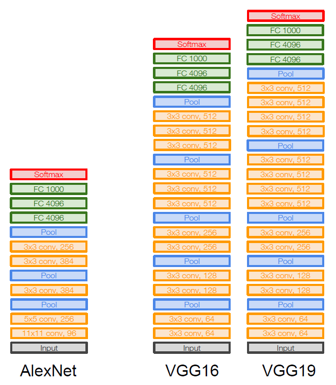
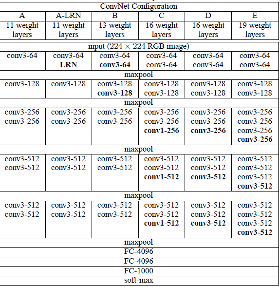
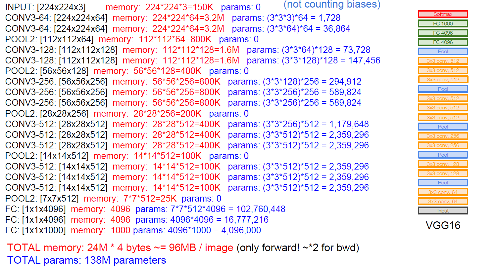
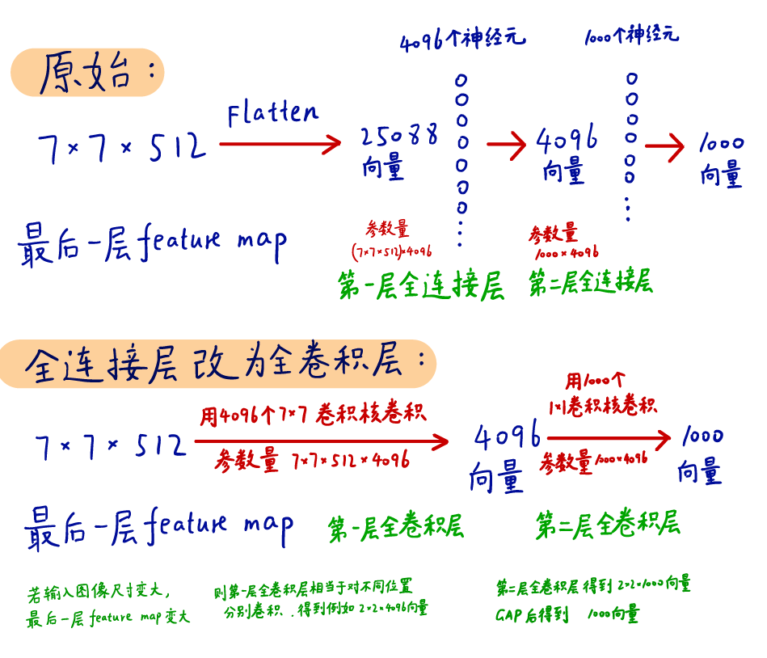
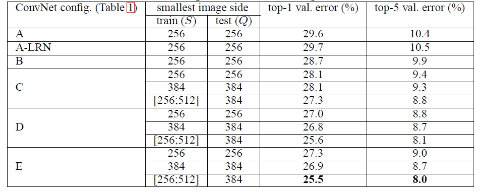
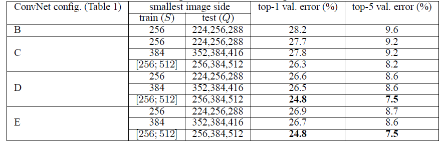
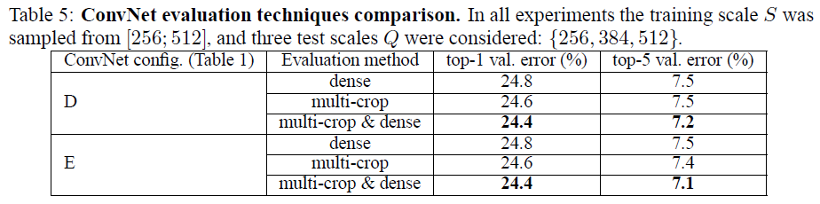

# VGGNet
> 文章标题：[Very Deep Convolutional Networks for Large-Scale Visual Recognition](https://arxiv.org/abs/1409.1556)
> 作者：[Simonyan K](https://scholar.google.com/citations?hl=zh-CN&user=L7lMQkQAAAAJ), [Zisserman A. V](https://scholar.google.com/citations?hl=zh-CN&user=UZ5wscMAAAAJ)
> 发表时间：(ICLR 2015)
> [论文主页](http://www.robots.ox.ac.uk/~vgg/research/very_deep/)

VGG是2014年ImageNet图像分类竞赛亚军，定位竞赛冠军，由牛津大学视觉组提出。

VGG16和VGG19经常作为各类计算机视觉任务的迁移学习骨干网络。

VGG将LeNet和AlexNet奠定的经典串行卷积神经网络结构的深度和性能发挥到极致。

将所有卷积核设置为3 x 3，减少参数量和计算量，共设置5个block，每进入新的block，卷积核个数翻倍。

VGG模型结构虽然简单，但臃肿复杂，参数过多（超过一亿个），速度慢，第一个全连接层占据了大量参数。

## Architecture

 

VGGNet16

<table border="0">
    <tr>
        <td></td>  
        <td></td>
    </tr>
    <tr >
            <td  colspan="2" align="center" style="color:orange; border-bottom: 1px solid #d9d9d9;color: #999;
padding: 2px;">VGGNet</td>
    </tr>
</table>

2层$3\times3$卷积的感受野相当于$5\times5$；3层$3\times3$卷积的感受野相当于$7\times7$。

 

VGGNet16参数计算

前两层卷积占据绝大部分内存；第一层全连接层占据绝大部分参数。

## Training

更快收敛：小的卷积核和深的网络起到隐式的正则化；对某些层进行权重初始化策略

训练图片尺寸：$S$为经过各向同性缩放的训练图像的短边，作为训练图片尺度。（AlexNet数据增强部分缩放尺度$S$为$256\times256$）

* 固定$S$

  > $S=256$或$S=384$

* 多尺度$S$

  > 随机从[256,512]选取

## Tseting

下面设缩放后图片短边为$Q$

* 全卷积：先将网络中的FC层全转换成卷积层（第一个FC -> 7 x 7的卷积层，后面两个FC -> 1 x 1的卷积层），因此预测时无需裁剪成224 x 224了（因为现在是全卷积网络），可以将整个图片喂入。Softmax层之前的输出（class score map）：feature map个数 = 类别数，为了能经过Softmax层，这里对每个feature map求全局平均池化GPA（global average pooling）。

  

  
   
  
全卷积

  

* 裁剪：还是AlexNet的思路，作者每个尺度裁剪50张图片，三个尺度一共150张图片（注意这里还是需要裁剪出224 x 224的）

## Experiments

* $Q$为固定值
  * LRN在这里不起作用
  * 训练多尺度很有效。

 

train多尺度，test单尺度（全卷积）

* $Q$为范围值

  > 若$S$为固定值：$Q=\{S-32,S,S+32\}$
  >
  > 若$S$为范围值：$Q=\{S_{min},\frac{S_{min}+S_{max}}{2},S_{max}\}$

  

  
   
  
train，test多尺度（全卷积）

  

* 全卷积和裁剪

  * 裁剪的效果更好，当然两者集成之后更好

 

  
   
  
train，test多尺度（全卷积和裁剪）

  

* 模型集成

## Localisation

Localisation定位问题（可看成目标检测的特例）（模型预测是bbox与Ground Truth的IoU大于0.5即可）：VGGNet改成预测bounding box（下面都简称为bbox）的模型，一个bbox用中心坐标、长、宽四个数确定，最后一个FC层换成4维（single-class regression，SCR，对所有类别不区分对待，即训练1个bbox）或4000维的向量（per-class regression，PCR，每个类别区分对待，即训练1000个bbox）。Softmax损失换成L2损失，训练单尺度模型，模型初始化使用之前的分类的模型，最后一层FC层随机初始化。

预测时：第一种方法是仅裁剪出图片中间的一块；第二种方法是用前面的全卷积，这种情况下最后会输出一堆bbox，于是可以对它们进行合并（基于前面分类的结果合并）。这里没有使用可以进一步提高结果的multiple pooling offsets和resolution enhancement technique（有待研究）。

## 拓展阅读

[牛津大学视觉组（VGG）官方网站](http://www.robots.ox.ac.uk/~vgg/)

[VGG原版Slides](http://www.robots.ox.ac.uk/~karen/pdf/ILSVRC_2014.pdf)

[VGG详解](https://blog.csdn.net/zzq060143/article/details/99442334)

[可视化VGG-16网络结构](https://dgschwend.github.io/netscope/#/preset/vgg-16)

[经典神经网络结构可视化](https://mp.weixin.qq.com/s/gktWxh1p2rR2Jz-A7rs_UQ)

[Convolutional neural networks on the iPhone with VGGNet](http://machinethink.net/blog/convolutional-neural-networks-on-the-iphone-with-vggnet/)

[翻译博客](https://blog.csdn.net/wspba/article/details/61625387)

