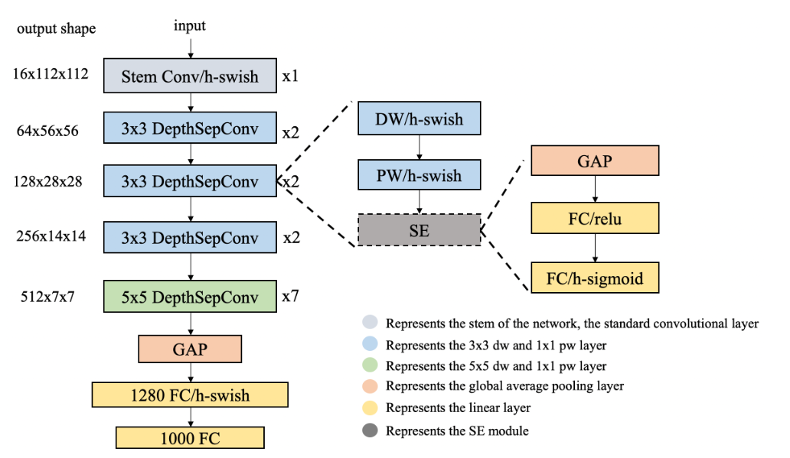
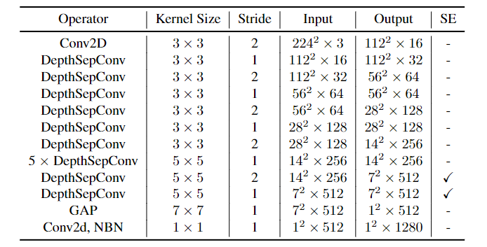
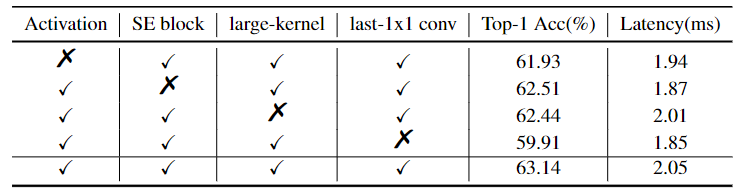
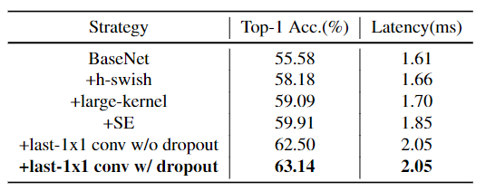

# PP-LCNet

> 文章标题：[PP-LCNet: A Lightweight CPU Convolutional Neural Network](https://arxiv.org/abs/2109.15099)
>
> 作者：Cheng Cui, Tingquan Gao, Shengyu Wei, Yuning Du, Ruoyu Guo, Shuilong Dong, Bin Lu, Ying Zhou, Xueying Lv, Qiwen Liu, Xiaoguang Hu, Dianhai Yu, Yanjun Ma
>
> 发表时间：(2021)
>
> [官方源码](https://github.com/PaddlePaddle/PaddleClas/tree/develop/ppcls/arch/backbone/legendary_models)

**设计流程**

* 全面摸底：将目前所有轻量级模型及组合模型在Intel CPU上做推理（开启MKLDNN）,记录推理时间和精度

* 总结归纳：寻找推理时间较小，精度较高的模型的特点

* 强强联合：组合这些block构建一个基本的baseline模型——BaseNet

* 锦上添花：基于BaseNet，实验性地添加学术界和工业界常用的提升模型性能的模块

  > 替换激活函数ReLU为**H-Swish**
  >
  > > 不涉及指数运算，模型推理时间几乎不变，精度提升2%~3%
  >
  > 合适位置添加SE模块
  >
  > > 

  > >  > src="LCNet.assets/LCNet_SE_location.png" >
  > >  
  > > 
 > display: inline-block;
  > > color: #999;
  > > padding: 2px;">LCNet_SE_location

  > > 

  >
  > 合适位置添加更大卷积核
  >
  > > kernel Size不是越大越好，有最优值
  > >
  > > 

  > >  > src="LCNet.assets/LCNet_large_kernel_location.png" >
  > >  
  > > 
 > display: inline-block;
  > > color: #999;
  > > padding: 2px;">LCNet_large_kernel_location

  > > 

  >
  > GAP后添加更大的1x1conv
  >
  > > GAP后直接接分类层，特征进一步整合加工会受限，添加一层大的1x1的conv层可以有效避免这个问题
  > >
  > > 推理时间增加：10%
  > >
  > > 精度增加：2%~3%
  
  

  
   
  
LCNet

  

  
  

  
   
  
LCNet

  

 

LCNet_ablation

 

LCNet_ablation

