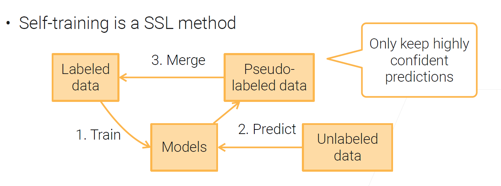

课程官网：https://c.d2l.ai/stanford-cs329p/

# 1 Data Collection

## 1.1 Course Introduction 课程介绍

Problem Formulate  问题规划
Collect & Process data 数据获取与处理
Train & tune models  训练、调试模型
Deploy models  部署模型
Monitor  监控

## 1.2 Data Acquisition 数据获取 

### **Finding Data 找数据 **

常见的数据集

> MNIST：手写数字数据集
>
> ImageNet：百万级图片
>
> AudioSet：Youtube的声音
>
> Kinetics：Youtube的视频
>
> KITTI：无人驾驶
>
> Amazon Review：亚马逊评论
>
> SQuAD：维基百科的问答对
>
> LibriSpeech：有声读物

Where

> [Wikipedia List of datasets for machine-learning research](https://en.wikipedia.org/wiki/List_of_datasets_for_machine-learning_research)：不提供下载
>
> [Machine learning datasets](https://www.datasetlist.com/)：不提供下载
>
> [公开数据集](https://www.graviti.cn/open-datasets)：提供下载
>
> [UCI Machine Learning Repository](https://archive.ics.uci.edu/ml/index.php)：提供下载
>
> [研究成果共享平台](https://figshare.com/)：提供下载
>
> [美国政府开发数据](https://www.data.gov/)：提供下载
>
> ==[Find and use datasets or complete tasks](https://www.kaggle.com/datasets)==
>
> ==[Paperswithcodes Datasets](https://paperswithcode.com/datasets)==
>
> Google Dataset search:网页搜索
>
> tensorflow huggingface框架提供
>
> 竞赛给出的数据集

### **Data integration 融合数据 **

> * 多个来源的数据合并成一个数据集
>
> * 多个表数据合并
>
>   (Practical Machi
>
> * 去除重复信息

### **Generate synthetic data 生成数据  **

> * **Use GANs**
> * **Data augmentations**

## 1.3 Web Scraping 网页数据抓取

抓取工具

> 没有图形界面的浏览器
>
> ```python
> from selenium import webdriver
> chrome_options = webdriver.ChromeOptions()
> chrome_options.headless = True
> chrome = wbdriver.Chrome(chrome_options=chrome_options)
> page = chrome.get(url)
> ```
>
> 通过公有云获取大量新IP（AWS）

 ## 1.4 Data Labeling 数据标注

**Semi-Supervised Learning（SSL）**

> Continuity assumption
>
> Cluster assumption
>
> Manifold assumption

**Self-training**



**Label through Crowdsourcing**


**Weak Supervision**

> Semi-automatically generate labels
>
> **Data programming**

# 2 Data Preprocessing

## 2.1 Exploratory data analysis 探索性数据分析

例子：数据清洗；箱图，热力图


## 2.2 Data cleaning 数据清理

Data Errors

## 2.3 Data Transformer 数据变换

Normalization for Real Value Columns


## 2.4 Feature Engineering 特征工程

**Tabular Data Features**  表格数据

* int/float ：直接使用或切分成n份（粗细粒度）
* Categorical data类别数据：one-hot encoding
* Data-time ：特征列表[year, month,  day, day_of_year, week_of_year, day_of_week]
* Feature combination：组合特征
  * [cat, dog]×[male, female]-->[(cat, male), (cat, female) , (dog, male), (dog, female)]  **内积**

**Text Features ** 文本数据

* Represent text as token features

  * Bag of words(BoW) model   每个词源用one-hot表示，然后加起来

  * word Emnedding (e.g. Word2vec)  词嵌入

    > 词用向量表示

* Pre-trained language models(e.g. BERT,GPT-3) 预训练语言模型

**Image/Video Features**

传统手动 提取特征 比如SIFT

现在使用预训练模型

## 2.5 Data Part Summary


# 3 ML model recap

## 3.1 ML Model Overview

**Types of ML Algorithms**

* Supervised  learning
  * 用有标签数据训练，预测标签
    * Self-Supervised：标签来自数据本身  比如：word2vec，BERT
* Semisupervised  learning
  * 有标签和（大量）无标签数据一起训练，学习一个模型去预测标签或将没有标签的数据把标签预测出来
    * self-training
* Unsupervised  learning
  * 用有标签数据训练
    * 聚类，GAN
* Reinforcement  learning
  * 模型与环境进行交互，采取行动获取最大化奖励

**Components in Supervised Training** 监督学习组成

* Model  将输入映射到标签的参数化函数
* Loss  衡量模型在预测结果方面有多好
* Objective  优化模型参数的目标
* Optimzation   该算法用于求解目标

**Types of Supervised Models**

* Decision trees
* Linear methods
* Kernel machines
* Neural Networks

## 3.2 Decision trees

## 3.3 Linear methods

## 3.4 SGD


## 3.5 Multilayer Perceptron（MLP）

## 3.6 CNN

## 3.7 RNN

# 4 Model Validation

## 4.1 Evaluation Metrics

**accuracy**:  correct predictions / examples

**precision**:  True positive /  (True positive + False positive)

**recall**:  True positive /  Positive examples

Be careful of division by 0
One metric that balances precision and recall

* F1: the harmonic mean of precision and recall: **2pr/(p + r)**

**AUC & ROC**


# 5 Model Combination

