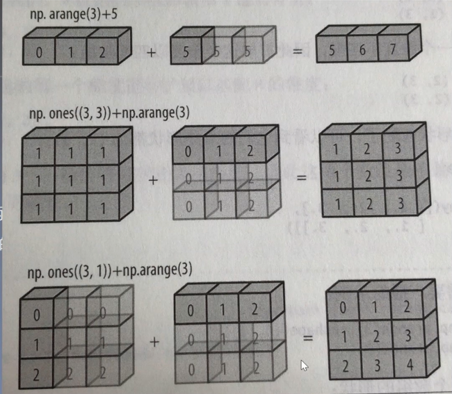
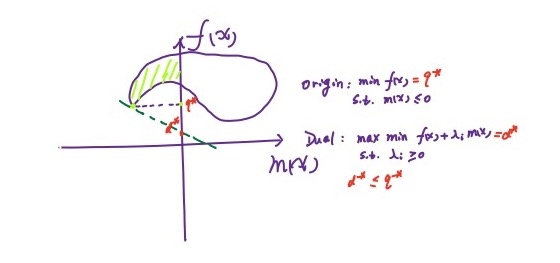
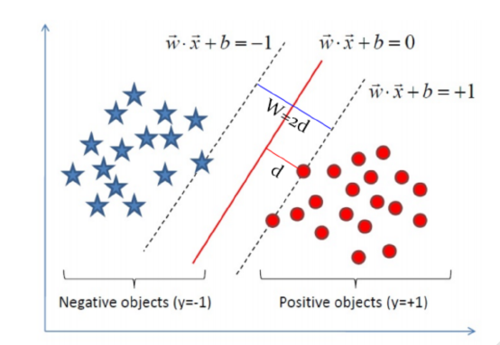

# Machine Learning

[toc]

# Matpoltlib 

> [Matpoltlib中文网](https://www.matplotlib.org.cn/)

Matplotlib是一个主要用于绘制二维图形的Python库。
用途：绘图、可视化
plt.plot() 只有一个输入列表或数组时，参数被当做Y轴，X轴以索引自动生成
plt.plot(x, y) 当有两个以上参数时，按照x轴和y轴顺序绘制数据点
plt.savefig() 将输出图形存储为文件，默认PNG格式，可以通过dpi修改输出质量

## 基础图标函数

| 函数 | 说明 |
| :--: | :--: |
|plt.plot(x,y,fmt,…) |绘制一个坐标图|
|plt.boxplot(data, notch, position) |绘制一个箱形图|
|plt.bar(left, height, width, bottom)| 绘制一个条形图|
|plt.barh(width, bottom, left, height) |绘制一个横向条形图|
|plt.polar(theta, r)| 绘制极坐标图|
|plt.pie(data, explode) |绘制饼图|
|plt.psd(x, NFFT=256, pad_to, Fs) |绘制功率谱密度图|
|plt.specgram(x, NFFT=256, pad_to, F) |绘制谱图|
|plt.cohere(x, y, NFFT=256, Fs) |绘制X-Y的相关性函数|
|plt.scatter(x, y) |绘制散点图，其中，x和y长度相同|
|plt.step(x, y, where) |绘制步阶图|
|plt.hist(x, bins, normed) |绘制直方图|
|plt.contour(X, Y, Z, N) |绘制等值图|
|plt.vlines() |绘制垂直图|
|plt.stem(x, y, linefmt, markerfmt) |绘制柴火图|
|plt.plot_date() |绘制数据日期|

# Numpy

> [Numpy中文网](https://www.numpy.org.cn/)

Numpy是Python科学计算库的基础。包含了强大的N维数组对象和向量运算。

高性能科学计算和数据分析的基础包。其部分功能如下：

* ndarray，一个具有矢量算术运算和复杂广播能力的快速且节省空间的多维数组。
* 用于对整组数据进行快速运算的标准数学函数（无需编写循环）。
* 用于读写磁盘数据的工具以及用于操作内存映射文件的工具。
*  线性代数、随机数生成以及傅里叶变换功能。
* 用于集成由C、C++、Fortran等语言编写的代码的工具。

## 数组创建

* **创建ndarray**：创建数组最简单的办法就是使用array函数。它接受一切序列型的对象（包括其他数组），然后产生一个新的含有传入数据的numpy数组。其中，嵌套序列（比如由一组等长列表组成的列表）将会被转换为一个多维数组

  ```python
  import numpy as np
  
  #将列表转换为数组
  array = np.array([[1,2,3],
                   [4,5,6]])
  print(array)
  ##############输出#########
  [[1 2 3]
   [4 5 6]]
  
  import numpy as np
  
  #将元组转换为数组
  array = np.array(((1,2,3),
                   (4,5,6)))
  print(array)
  ##############输出#########
  [[1 2 3]
   [4 5 6]]
  ```

* 除了np.array之外，还有一些函数也可以新建数组：

  * zeros和ones分别可以创建指定长度或者形状的全0或全1数组

  * Empty可以创建一个没有任何具体值的数组

  ```python
    zeroarray = np.zeros((2,3))
    print(zeroarray)
  ##############输出#########
  [[0. 0. 0.]
   [0. 0. 0.]]
  
  onearray = np.ones((3,4),dtype='int64')
  print(onearray)
  ##############输出#########
  [[1 1 1 1]
   [1 1 1 1]
   [1 1 1 1]]
  
  emptyarray = np.empty((3,4))
  print(emptyarray)
  ##############输出#########
  [[6.93476919e-310 6.93476919e-310 0.00000000e+000 0.00000000e+000]
   [0.00000000e+000 0.00000000e+000 0.00000000e+000 0.00000000e+000]
   [0.00000000e+000 0.00000000e+000 0.00000000e+000 0.00000000e+000]]
  ```


* **创建随机数组**

  * 均匀分布

    > np.random.rand(10, 10) 创建指定形状(示例为10行10列)的数组(范围在0至1之间)
    > np.random.uniform(0, 100) 创建指定范围内的一个数
    > np.random.randint(0, 100) 创建指定范围内的一个整数

  * 正态分布

    > np.random.normal(1.75, 0.1, (2, 3)) 给定均值/标准差/维度的正态分布

## 数组性质

### 数组属性

|  用法   |     说明     |
| :-----: | :----------: |
| b.size  | 数组元素个数 |
| b.shape |   数组形状   |
| b.ndim  |   数组维度   |
| b.dtype | 数组元素类型 |

```python
array = np.array([[1,2,3],[4,5,6],[7,8,9],[10,11,12]])
print(array)
#数组维度
print(array.ndim)
#数组形状
print(array.shape)
#数组元素个数
print(array.size)
#数组元素类型
print(array.dtype)
##############输出#########
[[ 1  2  3]
 [ 4  5  6]
 [ 7  8  9]
 [10 11 12]]
2
(4, 3)
12
int64
```

### 变形

```python
array1 = np.arange(6).reshape([2,3])
print(array1)
array2 = np.array([[1,2,3],[4,5,6]],dtype=np.int64).reshape([3,2])
print(array2)
##############输出#########
[[0 1 2]
 [3 4 5]]
[[1 2]
 [3 4]
 [5 6]]
```

### 索引

```python
arr1 = np.arange(0,6).reshape([2,3])
print(arr1)
print(arr1[1])
print(arr1[1][2])
print(arr1[1,2])

##############输出#########
[[0 1 2]
 [3 4 5]]
[3 4 5]
5
5
```

### 切片

> 数组切片是原始数组的视图。这意味着数据不会被复制，视图上的任何修改都会直接反映到源数组上

```python
arr1 = np.arange(0,6).reshape([2,3])
print(arr1[1,:])
print(arr1[:,1])
print(arr1[1,0:2])
##############输出#########
[3 4 5]
[1 4]
[3 4]
```

### 拼接

```python
arr1 = np.arange(0,6).reshape([2,3])
arr2 = np.arange(6,12).reshape([2,3])
# 水平拼接
arr3 = np.hstack([arr1, arr2])
# 垂直拼接
arr4 = np.vstack([arr1, arr2])
print(arr3)
print(arr4)
##############输出#########
[[ 0  1  2  6  7  8]
 [ 3  4  5  9 10 11]]
[[ 0  1  2]
 [ 3  4  5]
 [ 6  7  8]
 [ 9 10 11]]
```

### 分裂

```python
arr = np.arange(10)
# split用法
arr1, arr2,arr3 = np.split(arr, [2, 7])
print(arr1, arr2, arr3)
##############输出#########
[0 1] [2 3 4 5 6] [7 8 9]
```

## 数组计算

### 向量化

```python
arr1 = np.array([[1,2,3],[4,5,6]])
arr2 = np.ones([2,3],dtype=np.int64)

print(arr1 + arr2)
print(arr1 - arr2)
print(arr1 * arr2)
print(arr1 / arr2)
print(arr1 ** 2)

############输出######
[[2 3 4]
 [5 6 7]]
[[0 1 2]
 [3 4 5]]
[[1 2 3]
 [4 5 6]]
[[1. 2. 3.]
 [4. 5. 6.]]
[[ 1  4  9]
 [16 25 36]]
```

### 矩阵化

```python
arr1 = np.arange(9).reshape(3,3)
arr2 = np.arange(10, 19).reshape(3,3)
arr3 = arr1.T  # 矩阵转置
arr4 = np.dot(arr1, arr2)  # 矩阵乘法
arr5 = arr1.dot(arr2)
print(arr1)
print(arr2)
print(arr3)
print(arr4)
print(arr5)
############输出######
[[0 1 2]
 [3 4 5]
 [6 7 8]]
[[10 11 12]
 [13 14 15]
 [16 17 18]]
[[0 3 6]
 [1 4 7]
 [2 5 8]]
[[ 45  48  51]
 [162 174 186]
 [279 300 321]]
[[ 45  48  51]
 [162 174 186]
 [279 300 321]]
```

| 函数  |                             说明                             |
| :---: | :----------------------------------------------------------: |
| diag  | 以一维数组的形式返回方阵的对角线（或非对角线）元素，或将一维数组转换为方阵（非对角线元素为0 |
|  dot  |                           矩阵乘法                           |
| trace |                      计算对角线元素的和                      |
|  det  |                        计算矩阵行列式                        |
|  eig  |                  计算方阵的特征值和特征向量                  |
|  inv  |                         计算方阵的逆                         |
| pinv  |                 计算矩阵的Mooer-Penrose伪逆                  |
|  qr   |                          计算QR分解                          |
|  svd  |                    计算奇异值分解（SVD）                     |
| solve |              解线性方程组Ax=b，其中A为一个方阵               |
| lstsq |                     计算Ax=b的最小二乘解                     |

### 广播运算

如果两个数组形状在维度上不匹配，那么数组形式会沿着维度为1的维度进行拓展以匹配另一数组形状。

<center>

<br>
<div style="color:orange; border-bottom: 1px solid #d9d9d9;
display: inline-block;
color: #999;
padding: 2px;">广播运算</div>
</center>


### 比较运算和掩码其他通用函数

|      方法      |                         说明                         |
| :------------: | :--------------------------------------------------: |
|      sum       | 对数组中全部或某轴向的元素求和。零长度的数组的sum为0 |
|      mean      |         算术平均数。零长度的数组的mean为NaN          |
|    std, var    |      分别为标准差和方差，自由度可调（默认为n）       |
|    min, max    |                    最大值和最小值                    |
| argmin, argmax |              分别为最大和最小元素的索引              |
|     cumsum     |                    所有元素的累加                    |
|    cumprod     |                    所有元素的累积                    |


# Pandas

> [Pandas中文网](https://www.pypandas.cn/)

pandas是建立在numpy基础上的高效数据分析处理库，是Python的重要数据分析库。

pandas中有两大核心数据结构：==Series（一维数据）== 和==DataFrame（多特征数据,既有行索引,又有列索引）==

## Series

Series是一种类似于一维数组的对象，它由一维数组（各种numpy数据类型）以及一组与之相关的数据标签（即索引）组成。
###  创建Series
 使用Python数组创建
 使用numpy数组创建
 使用python字典创建
注意：与字典不同的是：Series允许索引重复

```python
import pandas as pd
import numpy as np

#与字典不同的是：Series允许索引重复
s = pd.Series(['a','b','c','d','e'],index=[100,200,100,400,500])
print(s)
############输出##########
100    a
200    b
100    c
400    d
500    e
dtype: object
    
# 使用numpy数组创建
s = np.arange(3, 6)
pd.Series(s)
############输出##########
0    3
1    4
2    5
dtype: int32

# 使用python字典创建
d = {'b': 1, 'a': 0, 'c': 2}
pd.Series(d)
############输出##########
b    1
a    0
c    2
dtype: int64
```

Series的字符串表现形式为：索引在左边，值在右边
如果没有为数据指定索引，则自动创建一个0到N-1（N为数据的长度）的整数型索引
可以通过Series的values和index属性获取其数组表示形式和索引对象
与普通numpy数组相比，可以通过索引的方式选取Series中的单个或一组值

```python
s = pd.Series(['a','b','c','d','e'],index=[100,200,100,400,500])
print(s)
print(s.values)
print(s.index)
############输出##########
100    a
200    b
100    c
400    d
500    e
dtype: object
['a' 'b' 'c' 'd' 'e']
Int64Index([100, 200, 100, 400, 500], dtype='int64')

#与普通numpy数组相比，可以通过索引的方式选取Series中的单个或一组值
print(s[100])
print(s[[400, 500]])
############输出##########
100    a
100    c
dtype: object
400    d
500    e
dtype: object
```
### Series索引对齐

Series中最重要的一个功能是：它会在算术运算中自动对齐不同索引的数据
Series 和多维数组的主要区别在于， Series 之间的操作会自动基于标签对齐数据。因此，不用顾及执行计算操作的 Series 是否有相同的标签。
Series对象本身及其索引都有一个name属性，该属性跟pandas其他的关键功能关系非常密切
Series的索引可以通过赋值的方式就地修改

```python
obj1 = pd.Series({"Ohio": 35000, "Oregon": 16000, "Texas": 71000, "Utah": 5000})
obj2 = pd.Series({"California": np.nan, "Ohio": 35000, "Oregon": 16000, "Texas": 71000})
obj3 = obj1 + obj2
print(obj3)
obj3.name = 'population'  # Series对象本身及其索引都有一个name属性
obj3.index.name = 'state'
print(obj3)
############输出##########
alifornia         NaN
Ohio           70000.0
Oregon         32000.0
Texas         142000.0
Utah               NaN
dtype: float64
state
California         NaN
Ohio           70000.0
Oregon         32000.0
Texas         142000.0
Utah               NaN
Name: population, dtype: float64
```

## DataFrame

DataFrame是一个表格型的数据结构，它含有一组有序的列，每列可以是不同的值类型（数值、字符串、布尔值等）
DataFrame既有行索引也有列索引，它可以被看做由Series组成的字典（共用同一个索引）
跟其他类似的数据结构相比（如R语言的data.frame），DataFrame中面向行和面向列的操作基本上是平衡的
DataFrame中的数据是以一个或多个二维块存放的（而不是列表、字典或别的一维数据结构）

### 创建DataFrame

用多维数组字典、列表字典生成 DataFrame

```python
data = {'state': ['Ohio', 'Ohio', 'Ohio', 'Nevada', 'Nevada'], 'year': [2000, 2001, 2002, 2001, 2002], 'pop': [1.5, 1.7, 3.6, 2.4, 2.9]}
frame = pd.DataFrame(data)
print(frame)
############输出##########
    state  year  pop
0    Ohio  2000  1.5
1    Ohio  2001  1.7
2    Ohio  2002  3.6
3  Nevada  2001  2.4
4  Nevada  2002  2.9

#如果指定了列顺序，则DataFrame的列就会按照指定顺序进行排列
frame1 = pd.DataFrame(data, columns=['year', 'state', 'pop'])
print(frame1)
############输出##########
   year   state  pop
0  2000    Ohio  1.5
1  2001    Ohio  1.7
2  2002    Ohio  3.6
3  2001  Nevada  2.4
4  2002  Nevada  2.9
```

用 Series 字典或字典生成 DataFrame

```python
d = {'one': pd.Series([1., 2., 3.], index=['a', 'b', 'c']),
     'two': pd.Series([1., 2., 3., 4.], index=['a', 'b', 'c', 'd'])}
print(pd.DataFrame(d))
############输出##########
   one  two
a  1.0  1.0
b  2.0  2.0
c  3.0  3.0
d  NaN  4.0
```

将嵌套字典（也就是字典的字典）传给DataFrame，它就会被解释为：外层字典的键作为列，内层键则作为行索引

```python
pop = {'Nevada': {2001: 2.4, 2002: 2.9}, 'Ohio':
{2000: 1.5, 2001: 1.7, 2002: 3.6}}
frame3 = pd.DataFrame(pop)
print(frame3)
############输出##########
      Nevada  Ohio
2000     NaN   1.5
2001     2.4   1.7
2002     2.9   3.6
```

## 索引

iloc函数

> iloc函数主要通过 行号 索引行数据。iloc函数索引的数据是int整型，因此是Python默认的前闭后开
>
> 利用iloc函数索引多行
>
> > 需要键入一个列表，而不是一串数字
> >
> > `df.iloc[0:8:2]`等价于1`df.iloc[[0,2,4,6]]`**索引奇数行**
> >
> > `df.iloc[:,1:3]`等价于`df.iloc[:,[1,2]]`**索引2，3列**

loc函数

> loc函数主要通过 行标签 索引行数据。loc函数索引的是字符串，前后都要取，是属于“前闭后闭”的情况。

## 计数

**value_counts()**

```python
value_counts(values,sort=True, ascending=False, normalize=False,bins=None,dropna=True)
```

> sort=True： 是否要进行排序；默认进行排序
> ascending=False： 默认降序排列；
> normalize=False： 是否要对计算结果进行标准化并显示标准化后的结果，默认是False。
> bins=None： 可以自定义分组区间，默认是否；
> dropna=True：是否删除缺失值nan，默认删除

**counts()**

```python
count(str,start=0 ,end=len(string)
```

> str：要搜索的子字符串
> start：开始搜索的位置，默认是0，也就是从第一个字符开始搜索。
> end：结束搜索的位置，默认在最后一个字符停止搜索。

# K近邻

## 工作原理

给定一个已知标签类别的训练数据集，输入没有标签的新数据后，在训练数据集中找到与新数据最邻近的K个实例，如果这K个实例的多数属于某个类别，那么新数据就属于这个类别。

==**模型三基本要素**==：距离度量，$k$值选择，分类决策规则

## 算法

输入：训练数据集$T=\{(x_1,y_1),(x_2,y_2),...,(x_N,y_N)\}$

其中，$x_i\in X \subseteq R^n$为实例的特征向量，$y_i\in Y=\{c_1,c_2,..,c_K\}$为实例的类别，$i=1,2,...,N$;实例特征向量$x$;

输出：实例$x$所属类$y$。

（1）根据给定的距离度量，在训练集$T$中找出与x最邻近的$k$个点，涵盖这$k$个点的$x$的邻域记作$N_k(x)$;
（2）在$N_k(x)$中根据分类决策规则（如多数表决）决定$x$的类别$y$:
$$
\begin{equation}
	y = \mathop{\arg\max}_{\theta} \sum_{x_i\in N_k(x)} I(y_i=c_j),i=1,2,...,N;j=1,2,..,K
\end{equation}
$$
$I$为指示函数，即当$y_i=c_j$,$I$为1，否则为0.

$k=1$时，为最近邻法。

K近邻算法步骤如下：

> (1)计算已知类别数据集中的点与当前点之间的距离;
> (2)按照距离递增次序排序;
> (3)选取与当前点距离最小的k个点;
> (4)确定前k个点所在类别的出现频率;
> (5)返回前k个点出现频率最高的类别作为当前点的预测类别.

```python
import pandas as pd
"""
函数功能:KNN分类器
参数说明
       new_data:需要预测分类的数据集
       dataSet:已知分类标签的数据集(训练集
       k:k-近邻算法参数,选择距离最小的k个点
返回:
       result:分类结果
"""

def classify0(inx, dataSet, k):
    result = []
    # 2.计算已知类别数据集中的点与当前点之间的距离
    dist = list((((dataSet.iloc[:, 1:3] - inx) ** 2).sum(1)) ** 0.5)
    # 3.将距离升序排列，选取距离最小的k个点
    dist_1 = pd.DataFrame({'dist': dist, 'labels': (dataSet.iloc[:, 3])})  
    dr = dist_1.sort_values(by='dist')[: k]
    # 4.确定前k个点所在类别的出现频率
    re = dr.loc[:, 'labels'].value_counts()
    # 5.选择频率最高的类别为当前点的预测类别
    result.append(re.index[0])  
    return result


rowdata = {'电影名称': ['无问西东', '后来的我们', '前任3', '红海行动', '唐人街探案', '战狼2'],
           '打斗镜头': [1, 5, 12, 108, 112, 115],
           '接吻镜头': [101, 89, 97, 5, 9, 8],
           '电影类型': ['爱情片', '爱情片', '爱情片', '动作片', '动作片', '动作片']}
dataSet = pd.DataFrame(rowdata)
inx = [24, 67]
k = 3
print(classify0(inx, dataSet, k))
######输出#####
['爱情片']
```

## 算法总结

|  k-近邻  |                                                              |
| :------: | ------------------------------------------------------------ |
| 算法功能 | 分类(核心)，回归                                             |
| 算法类型 | 有监督学习-惰性学习，距离类模型                              |
| 数据输入 | 包含数据标签y，且特征空间至少包含k个训练样本(k>=1)<br>特征空间中各个特征的量纲需统一,若不统一则需要进行归一化处理<br>自定义的超参数k(k>=1) |
| 模型输出 | 在KNN分类中,输出是标签中的某个类别<br>在KNN回归中,输出是对象的属性值,该值是距离输入的数据最近的k个训练样本标签的平均值 |

### 优点

* 简单好用,容易理解,精度高,理论成熟,既可以用来做分类也可以用来做回归

* 可用于数值型数据和离散型数据

* 无数据输入假定

* 适合对稀有事件进行分类

### 缺点

* 计算复杂性高;空间复杂性高;
*  计算量太大,所以一般数值很大的时候不用这个,但是单个样本又不能太少,否则容易发生误分
* 样本不平衡问题(即有些类别的样本数量很多,而其它样本的数量很少)
* 可理解性比较差,无法给出数据的内在含义

# 决策树

> 分类决策树模型是表示基于特征对实例进行分类的树形结构。决策树可以转换成一个**if-then**规则的集合，也可以看作是定义在特征空间划分上的类的条件概率分布。
>
> 决策树学习算法3部分：==特征选择，决策树生成，剪枝==

## 特征选择

特征选择就是决定用哪个特征来划分特征空间,其目的在于选取对训练数据具有分类能力的特征。

通常特征选择的准则是信息增益或信息增益比。

熵越高,信息的不纯度就越高。也就是混合的数据就越多。

### 特征选择准则

**信息增益**( Information gain)的计算公式其实就是父结点的信息熵与其下所有子结点总信息熵之差。但这里要注意的是,此时计算子节点的总信息熵不能简单求和,而要求在求和汇总之前进行修正。

香农熵的python代码如下：

```python
def calEnt(dataSet):
    n = dataSet.shape[0] #数据集总行数
    iset = dataSet.iloc[:,-1].value_counts() #标签的所有类别
    p = iset/n #每一类标签所占比
    ent = (-p*np.log2(p)).sum() #计算信息熵
    return ent
```

划分数据集的最大准则是选择**最大信息增益**,也就是信息下降最快的方向。

```python
'''
函数功能:根据信息增益选择出最佳数据集切分的列
参数说明
       dataset:原始数据集
返回
       axis:数据集最佳切分列的索引
'''
#选择最优的列进行切分
def bestSplit(dataSet):
    baseEnt = calEnt(dataSet) #计算原始熵
    bestGain = 0 #初始化信息增益
    axis = -1 #初始化最佳切分列，标签列
    for i in range(dataSet.shape[1]-1): #对特征的每一列进行循环
        levels= dataSet.iloc[:,i].value_counts().index #提取出当前列的所有取值
        ents = 0 #初始化子节点的信息熵
        for j in levels: #对当前列的每一个取值进行循环
            childSet = dataSet[dataSet.iloc[:,i]==j] #某一个子节点的dataframe
            ent = calEnt(childSet) #计算某一个子节点的信息熵
            ents += (childSet.shape[0]/dataSet.shape[0])*ent #计算当前列的信息熵
            #print(f'第{i}列的信息熵为{ents}')
        infoGain = baseEnt-ents #计算当前列的信息增益
        #print(f'第{i}列的信息增益为{infoGain}')
        if (infoGain > bestGain):
            bestGain = infoGain #选择最大信息增益
            axis = i #最大信息增益所在列的索引
    return axis
```

```python
'''
函数功能:按照给定的列划分数据集
参数说明:
       dataset:原始数据集
       axis:指定的列索引
       value:指定的属性值
返回:
       redataset:按照指定列索引和属性值切分后的数据集
'''
def mySplit(dataSet, axis, value):
    col = dataSet.columns[axis]
    redataSet = dataSet.loc[dataSet[col] == value, :].drop(col, axis=1)
    return redataSet
```

（1）特征$A$对样本集合$D$的**信息增益**（ID3）
$$
g(D, A)=H(D)-H(D|A)
$$

$$
H(D)=-\sum_{k=1}^{K} \frac{\left|C_{k}\right|}{|D|} \log _{2} \frac{\left|C_{k}\right|}{|D|}
$$

$$
H(D | A)=\sum_{i=1}^{n} \frac{\left|D_{i}\right|}{|D|} H\left(D_{i}\right)
$$

其中，$H(D)$是数据集$D$的熵，$H(D_i)$是数据集$D_i$的熵，$H(D|A)$是特征$A$对数据集$D$的条件熵。	$D_i$是$D$中特征$A$取第$i$个值的样本子集，$C_k$是$D$中属于第$k$类的样本子集。$n$是特征$A$取值的个数，$K$是类的个数。

（2）特征$A$对样本集合$D$的**信息增益比（**C4.5）

$$
g_{R}(D, A)=\frac{g(D, A)}{H(D)}
$$


其中，$g(D,A)$是信息增益，$H(D)$是数据集$D$的熵。

（3）样本集合$D$的**基尼指数**（CART）

$$
\operatorname{Gini}(D)=1-\sum_{k=1}^{K}\left(\frac{\left|C_{k}\right|}{|D|}\right)^{2}
$$


特征$A$条件下集合$D$的基尼指数：

$$
\operatorname{Gini}(D, A)=\frac{\left|D_{1}\right|}{|D|} \operatorname{Gini}\left(D_{1}\right)+\frac{\left|D_{2}\right|}{|D|} \operatorname{Gini}\left(D_{2}\right)
$$

## 构建决策树

> 决策树的生成往往通过计算信息增益或其他指标，从根结点开始，递归地产生决策树。这相当于用信息增益或其他准则不断地选取局部最优的特征，或将训练集分割为能够基本正确分类的子集。

### ID3算法

#### 递归构建

```python
'''
函数功能:基于最大信息增益切分数据集,递归构建决策树
参数说明：
       dataset:原始数据集(最后一列是标签)
返回：
        myTree:字曲形式的树
'''
def createTree(dataSet):
    featlist = list(dataSet.columns)  # 提取出数据集所有的列
    classlist = dataSet.iloc[:,-1].value_counts()  # 获取最后一列类标签
    # 判断最多标签数目是否等于数据集行数，或者数据集是否只有一列
    if classlist[0] == dataSet.shape[0] or dataSet.shape[1] == 1:
        return classlist.index[0]  # 如果是，返回类标签
    axis = bestSplit(dataSet)  # 确定出当前最佳切分列的索引
    bestfeat = featlist[axis]  # 获取该索引对应的特征
    myTree = {bestfeat: {}}  # 采用字典嵌套的方式存储树信息
    del featlist[axis]  # 删除当前特征
    valuelist = set(dataSet.iloc[:, axis])  # 提取最佳切分列所有属性值
    for value in valuelist:  # 对每一个属性值递归建树
        myTree[bestfeat][value] = createTree(mySplit(dataSet,axis,value))
    return myTree
```

#### 保存

```python
# 树的存储
np.save('myTree.npy', myTree)
# 树的读取
read_myTree = np.load('myTree.npy').item()
```

#### 使用决策树执行分类

```python
'''
函数功能:对一个测试实例进行分类
参数说明:
        InputTree:已经生成的决策树
        labels:存储选择的最优特征标签
        testvec:测试数据列表,顺序对应原数据集
返回:
        classlabel:分类结果
'''
def classify(inputTree, labels, testVec):
    firstStr = next(iter(inputTree))  # 获取决策树第一个节点
    secondDict = inputTree[firstStr]  # 下一个字典
    featIndex = labels.index(firstStr)  # 第一个节点所在列的索引
    for key in secondDict.keys():
        if testVec[featIndex] == key:
            if type(secondDict[key]) == dict:
                classLabel = classify(secondDict[key], labels, testVec)
            else:
                classLabel = secondDict[key]
    return classLabel
```

```python
'''
函数功能:对测试集进行预测,并返回预测后的结果
参数说明
       train:训练集
       test:测试集
返回
    test:预测好分类的测试集
'''
def acc_classify(train, test):
    inputTree = createTree(train)  # 根据测试集生成一棵树
    labels = list(train.columns)  # 数据集所有的列名称
    result = []
    for i in range(test.shape[0]):  # 对测试集中每一条数据进行循环
        testVec = test.iloc[i, :-1]  # 测试集中的一个实例
        classLabel = classify(inputTree, labels, testVec)  # 预测该实例的分类
        result.append(classLabel)  # 将分类结果追加到result列表中
    test['predict']=result  # 将预测结果追加到测试集最后一列
    acc = (test.iloc[:, -1] == test.iloc[:, -2]).mean()  # 计算准确率
    print(f'模型预测准确率为{acc}')
    return test

```

### C4.5算法

## 剪枝

由于生成的决策树存在过拟合问题，需要对它进行剪枝，以简化学到的决策树。决策树的剪枝，往往从已生成的树上剪掉一些叶结点或叶结点以上的子树，并将其父结点或根结点作为新的叶结点，从而简化生成的决策树。

## 决策树可视化

### 使用SKlearn中graphviz包实现

```python
from sklearn import tree
from sklearn.tree import DecisionTreeClassifier
import graphviz

#特征
Xtrain = dataSet.iloc[:, :-1]
#标签
Ytrain = dataSet.iloc[:, -1]
labels = Ytrain.unique().tolist()
Ytrain = Ytrain.apply(lambda x: labels.index(x)) #将本文转换为数字
#绘制树模型
clf = DecisionTreeClassifier()
clf = clf.fit(Xtrain, Ytrain)
tree.export_graphviz(clf)
dot_data = tree.export_graphviz(clf, out_file=None)
graphviz.Source(dot_data)
#给图形增加标签和颜色
dot_data = tree.export_graphviz(clf, out_file=None,
                                feature_names=['no surfacing', 'flippers'],
                                class_names=['fish', 'not fish'],
                                filled=True, rounded=True,
                                special_characters=True)
graphviz.Source(dot_data)
#利用render方法生成图形
graph = graphviz.Source(dot_data)
graph.render("fish")
```

### Matplotlib注解工具annotation

> [annotation](https://matplotlib.org/2.0.2/users/annotations.html)
>
> * getNumLeafs:获取决策树叶子结点的数目
> * getTreeDepth:获取决策树的层数
> * plotNode:绘制结点
> * plotMidText:标注有向边属性值
> * plotTree:绘制决策树
> * createPlot:创建绘制面板(主函数)

#### 1.计算叶子结点数目

```python
'''函数功能:递归计算叶子节点的数目
参数说明
       myTree:字典形式的树
返回
       numLeafs:叶节点数目
'''
def getNumLeafs(myTree):
    numLeafs = 0  # 初始化叶节点数目
    firstStr = next(iter(myTree))  # 获得树的第一个键值，即第一个特征
    secondDict = myTree[firstStr]  # 获取下一组字典
    for key in secondDict.keys():
        if type(secondDict[key]) == dict:  # 测试该节点是否为字典
            numLeafs += getNumLeafs(secondDict[key])  # 是字典，递归，循环计算新分支叶节点数
        else:
            numLeafs += 1  # 不是字典，代表此结点为叶子结点
    return numLeafs
```
#### 2.计算数深度

```python
'''
函数功能:递归计算树的深度
参数说明:
       myTree:字典形式的树
返回:
       maxDepth:树的最大深度
'''
def getTreeDepth(myTree):
    maxDepth = 0
    firstStr = next(iter(myTree))
    secondDict = myTree[firstStr]
    for key in secondDict.keys():
        if type(secondDict[key]) == dict:
            thisDepth = 1+getTreeDepth(secondDict[key])
        else:
            thisDepth = 1
        if thisDepth > maxDepth:
            maxDepth = thisDepth
    return maxDepth
```

#### 3.绘制结点

```python
'''
函数功能:绘制结点
参数说明:
        nodeTxt：结点点名
        centerPt：文本位置
        parentPt：标注的箭头位置
        nodeType：节点格式
'''
def plotNode(nodeTxt, cntrPt, parentPt, nodeType):
    arrow_args = dict(arrowstyle="<-")  # 定义箭头格式
    createPlot.ax1.annotate(nodeTxt,
                            xy=parentPt,xycoords='axes fraction',
                            xytext=cntrPt, textcoords='axes fraction',
                            va="center", ha="center",
                            bbox=nodeType,
                            arrowprops=arrow_args)
```

#### 4.标注有向边属性值

```python
'''
函数功能:标注有向边属性值
参数说明:
      cntrPt、parentPt：用于计算标注位置
      txtString：标注的内容
'''
def plotMidText(cntrPt, parentPt, txtString):
    xMid = (parentPt[0]-cntrPt[0])/2.0 + cntrPt[0]  # 计算标注位置的横坐标
    yMid = (parentPt[1]-cntrPt[1])/2.0 + cntrPt[1]  # 计算标注位置的纵坐标
    createPlot.ax1.text(xMid, yMid, txtString, va="center", ha="center", rotation=0)
```

#### 5.绘制决策树

```python
'''
函数功能:绘制决策树
参数说明:
    myTree：决策树(字典)
    parentPt：标注的内容
    nodeTxt：节点名
'''
def plotTree(myTree, parentPt, nodeTxt):
    decisionNode = dict(boxstyle="sawtooth", fc="0.8")  # 设置中间节点格式
    leafNode = dict(boxstyle="round4", fc="0.8")  # 设置叶节点格式
    numLeafs = getNumLeafs(myTree)  # 获取决策树叶结点数目，决定了树的宽度
    depth = getTreeDepth(myTree)  # 获取决策树层数
    firstStr = next(iter(myTree))  # 下个字典
    cntrPt = (plotTree.xOff+(1.0+float(numLeafs))/2.0/plotTree.totalW,plotTree.yOff) # 确定中心位置
    plotMidText(cntrPt, parentPt, nodeTxt)  # 标注有向边属性值
    plotNode(firstStr, cntrPt, parentPt, decisionNode)  # 绘制节点
    secondDict = myTree[firstStr]  # 下一个字典，也就是继续绘制子结点
    plotTree.yOff = plotTree.yOff - 1.0/plotTree.totalD  # y偏移
    for key in secondDict.keys():
        if type(secondDict[key]) == dict:  # 测试该结点是否为字典
            plotTree(secondDict[key],cntrPt,str(key))  # 是字典则不是叶结点，递归调用继续绘制
        else:
            plotTree.xOff = plotTree.xOff + 1.0/plotTree.totalW  # x偏移
            plotNode(secondDict[key], (plotTree.xOff, plotTree.yOff), cntrPt, leafNode)
            plotMidText((plotTree.xOff, plotTree.yOff), cntrPt, str(key))
    plotTree.yOff = plotTree.yOff + 1.0/plotTree.totalD
```

#### 6. 创建绘制面板

```python
"""
函数功能:创建绘制面板
参数说明:
       inTree：决策树(字典)
"""
def createPlot(inTree):
    fig = plt.figure(1, facecolor='white')  # 创建fig
    fig.clf()  # 清空fig
    axprops = dict(xticks=[], yticks=[])
    createPlot.ax1 = plt.subplot(111, frameon=False, **axprops)  # 去掉x、y轴
    plotTree.totalW = float(getNumLeafs(inTree))  # 获取决策树叶结点数目
    plotTree.totalD = float(getTreeDepth(inTree))  # 获取决策树深度
    plotTree.xOff = -0.5/plotTree.totalW  # x偏移的初始值
    plotTree.yOff = 1.0  # y偏移的初始值
    plotTree(inTree, (0.5,1.0), '')  # 绘制决策树
    plt.show()  # 显示绘制结果

```

* 对于 plotTree函数参数赋值为(0.5,1.0)

 >  因为开始的根节点并不用划线,因此父节点和当前节点的位置需要重合,为(0.5,1.0)

## 算法总结

###  优点

* 决策树可以可视化，易于理解和解释；

* 数据准备工作很少。其他很多算法通常都需要数据规范化，需要创建虚拟变量并删除空值等；

* 能够同时处理数值和分类数据，既可以做回归又可以做分类。
  
* 效率高,决策树只需要一次构建，反复使用，每一次预测的最大计算次数不超过决策树的深度；

* 能够处理多输出问题，即含有多个标签的问题，注意与一个标签中含有多种标签分类的问题区别开；

* 是—个白盒模型，结果很容易能够被解释。
### 缺点
* 递归生成树的方法很容易出现过拟合。
* 决策树可能是不稳定的，因为即使非常小的变异，可能会产生一颗完全不同的树
* 如果某些分类占优势，决策树将会创建一棵有偏差的树。因此，建议在拟合决策树之前平衡数据集。

# 朴素贝叶斯

## 贝叶斯推断

根据条件概率和全概率公式，可得贝叶斯公式
$$
P(Y | X)=P(Y)\frac{P(X|Y)}{P(X)}
$$

$$
P(Y_i | X)=\frac{P(Y_i) P(X | Y_i)}{\sum_{i=1}^n P(Y_i) P(X | Y_i)}
$$


**P(Y)称为"先验概率"( Prior probability)**，即在X事件发生之前，我们对Y事件概率的一个判断
**P(Y|X)称为''后验概率”(Posterior probability)**，即在X事件发生之后，我们对Y事件概率的重新评估
**P(X|Y)/P(X)称为"可能性函数"( Likely hood)**，这是一个调整因子，使得预估概率更接近真实概率。
所以条件概率可以理解为：**后验概率=先验概率*调整因子**
如果"可能性函数">1，意味着"先验概率"被増强，事件Y的发生的可能性变大
如果"可能性函数"=1，意味着X事件无助于判断事件Y的可能性
如果"可能性函数"<1，意味着"先验概率"被削弱，事件Y的可能性变小

## 朴素贝叶斯种类

### GaussianNB 

GaussianNB就是先验为高斯分布(正态分布)的朴素贝叶斯，假设每个标签的数据都服从简单的正态分布。

$$
P(X_j=x_i | Y=C_k)=\frac{1}{\sqrt{2\pi\sigma^2_{k}}}exp(-\frac{(x_i-\mu_{k})^2}{2\sigma^2_{k}})
$$


其中$C_k$为$Y$的第$k$个类别。数学期望(mean)：$\mu$，方差：$\sigma^2=\frac{\sum(X-\mu)^2}{N}$

Sklearn实现：

```python
# 导入包
import pandas as pd
from sklearn.naive_bayes import GaussianNB
from sklearn.model_selection import train_test_split
from sklearn.metrics import accuracy_score
# 导入数据集
from sklearn import datasets
iris = datasets.load_iris()
# 切分数据集
Xtrain, Xtest, ytrain, ytest = train_test_split(iris.data,
                                                iris.target,
                                                random_state=12)
# 建模
clf = GaussianNB()
clf.fit(Xtrain, ytrain)

# 在测试集上执行预测，proba导出的是每个样本属于某类的概率
clf.predict(Xtest)
# 测试准确率
acc = accuracy_score(ytest, clf.predict(Xtest))
```


### MultinomialNB

MultinomialNB就是先验为多项式分布的朴素贝叶斯。它假设特征是由一个简单多项式分布生成的。

多项分布可以描述各种类型样本岀现次数的概率，因此多项式朴素贝叶斯非常适合用于描述岀现次数或者岀现次数比例的特征。
该模型常用于文本分类，特征表示的是次数，例如某个词语的出现次数。
多项式分布公式如下
$$
P(X_j=x_{jl} | Y=C_k)=\frac{x_{jl}+\lambda}{m_k+n\lambda}
$$
其中$P(X_j=x_{jl} | Y=C_k)$是第$k$个类别的第$j$维特征的第$l$个取值条件概率。$m_k$是训练集中输出为第$k$类的样本个数。$\lambda$为一个大于0的常数，常常取1，即拉普拉斯平滑。

### BernoulliNB

Bernoulli就是先验为伯努利分布的朴素贝叶斯。假设特征的先验概率为二元伯努利分布，即如下式
$$
P(X_j=x_{jl} | Y=C_k)=P(j|Y=C_k)x_{jl}+(1-P(j|Y=C_k)(1-x_{j;)}))
$$
此时$l$只有两种取值能，取值0或者1
在伯努利模型中，每个特征的取值是布尔型的,即true和 false，或者1和0。在文本分类中,就是一个特征有没有在文档中出现。

### 总结

* 一般来说，如果样本特征的分布大部分是连续值，使用 Gaussian会比较好。
* 如果如果样本特征的分布大部分是多元离散值，使用 MultinomiaINB比较合适。
* 而如果样本特征是二元离散值或者很稀疏的多元离散值，应该使用 BernoulliaNB。

## 朴素贝叶斯进行鸢尾花分类

```python
import numpy as np
import pandas as pd
import random
"""
函数功能：切分训练集和测试集
参数说明：
    dataSet:输入的数据集
    rate：训练集所占比例
返回：
    train,test:切分好的训练集和测试集
"""
def randSplit(dataSet, rate):
    l = list(dataSet.index)  # 提取出索引
    random.shuffle(l)  # 随机打乱索引
    dataSet.index = l  # 将打乱后的索引重新赋值给原数据集
    n = dataSet.shape[0]  # 总行数
    m = int(n * rate)  # 训练集的数量
    train = dataSet.loc[range(m), :]  # 提取前m个记录作为训练集
    test = dataSet.loc[range(m, n), :]  # 剩下的作为测试集
    dataSet.index = range(dataSet.shape[0])  # 更新原数据集的索引
    test.index = range(test.shape[0])  # 更新测试集的索引
    return train, test

# 构建高斯朴素贝叶斯分类器
def gnb_classify(train, test):
    labels = train.iloc[:, -1].value_counts().index  # 提取训练集的标签种类
    mean = []  # 存放每个类别的均值
    std = []  # 存放每个类别的方差
    result = []  # 存放测试集的预测结果
    for i in labels:
        item = train.loc[train.iloc[:, -1] == i, :]  # 分别提取出每一种类别
        m = item.iloc[:, :-1].mean()  # 当前类别的平均值
        s = np.sum((item.iloc[:, :-1]-m)**2)/(item.shape[0])  # 当前类别的方差
        mean.append(m)  # 将当前类别的平均值追加至列表
        std.append(s)  # 将当前类别的方差追加至列表
    means = pd.DataFrame(mean, index=labels)  # 变成DF格式，索引为类标签
    stds = pd.DataFrame(std, index=labels)  # 变成DF格式，索引为类标签
    for j in range(test.shape[0]):
        iset = test.iloc[j, :-1].tolist()  # 当前测试实例
        iprob = np.exp(-1*(iset-means)**2/(stds*2))/(np.sqrt(2*np.pi*stds))  # 正态分布公式
        prob = 1  # 初始化当前实例总概率
        for k in range(test.shape[1]-1):  # 遍历每个特征
            prob *= iprob[k]  # 特征概率之积即为当前实例概率
            cla = prob.index[np.argmax(prob.values)]  # 返回最大概率的类别
        result.append(cla)
    test['predict'] = result
    acc = (test.iloc[:, -1] == test.iloc[:, -2]).mean()  # 计算预测准确率
    print(f'模型预测准确率为{acc}')
    return test

# 导入数据集
dataSet = pd.read_csv('iris.txt', header=None)
# 切分训练集与测试集
train, test = randSplit(dataSet, 0.8)
# 测试模型预测效果
gnb_classify(train, test)
# 运行10次，查看结果
for i in range(20):
    train, test = randSplit(dataSet, 0.8)
    gnb_classify(train, test)
```

## 朴素贝叶斯之文档分类

> * loadDataSet：创建实验数据集
> * createVocabList：生成词汇表
> * setOfWords2Vec：生成词向量
> * get_trainMat：所有词条向量列表
> * trainNB：朴素贝叶斯分类器训练函数
> * classifyNB：朴素贝叶斯分类器分类函数
> * testingNB：朴素贝叶斯测试函数

### 1.创建实验数据集

```python
'''
函数功能:创建实验数据集
参数说明:无参数
返回:
    dataset:切分好的样本词条
    classed:类标签向量
'''
def loadDataSet():
    dataSet=[['my', 'dog', 'has', 'flea', 'problems', 'help', 'please'],
             ['maybe', 'not', 'take', 'him', 'to', 'dog', 'park', 'stupid'],
             ['my', 'dalmation', 'is', 'so', 'cute', 'I', 'love', 'him'],
             ['stop', 'posting', 'stupid', 'worthless', 'garbage'],
             ['mr', 'licks', 'ate', 'my', 'steak', 'how', 'to', 'stop', 'him'],
             ['quit', 'buying', 'worthless', 'dog', 'food', 'stupid']]  # 切分好的词条
    classVec = [0, 1, 0, 1, 0, 1]  # 类别标签向量，1代表侮辱性词汇，0代表非侮辱性词汇
    return dataSet, classVec
```

### 2.构建词汇表

```python
'''
函数功能:将切分的样本词条整理成词汇表(不重复)
参数说明
       dataset:切分好的样本词条
返回
       vocalist:不重复的词汇表
'''
def createVocabList(dataSet):
    vocabSet = set()  # 创建一个空的集合
    for doc in dataSet:  # 遍历dataSet中的每一条言论
        vocabSet = vocabSet | set(doc)  # 取并集
        vocabList = list(vocabSet)
    return vocabList
```

### 3.获得训练集向量

生成词向量：

```python
'''
函数功能:根据vocaList词汇表,将inputSet向量化,向量的每个元素为1或0
参数说明：
         vocaList:词汇表
         inputSet:切分好的词条列表中的一条
返回:
          returnVec:文档向量,词集模型
'''
def setOfWords2Vec(vocabList, inputSet):
    returnVec = [0] * len(vocabList)  # 创建一个其中所含元素都为0的向量
    for word in inputSet:  # 遍历每个词条
        if word in vocabList:  # 如果词条存在于词汇表中，则变为1
            returnVec[vocabList.index(word)] = 1
        else:
            print(f" {word} is not in my Vocabulary!")
    return returnVec  # 返回文档向量
```

所有词条向量列表：

```python
'''
函数功能:生成训练集向量列表
参数说明：
       dataset:切分好的样本词条
返回：
        trainMat:所有的词条向量组成的列表
'''
def get_trainMat(dataSet):
    trainMat = []  # 初始化向量列表
    vocabList = createVocabList(dataSet)  # 生成词汇表
    for inputSet in dataSet:  # 遍历样本词条中的每一条样本
        returnVec = setOfWords2Vec(vocabList, inputSet)  # 将当前词条向量化
        trainMat.append(returnVec)  # 追加到向量列表中
    return trainMat
```


### 4.朴素贝叶斯分类器训练函数

```python
'''
函数功能:朴素贝叶斯分类器训练函数
参数说明:
       trainMat:训练文档矩阵
       classeVec:训练类别标签向量
返回:
        pOv:非侮辱类的条件概率数组
        p1v:侮辱类的条件概率数组
        pAb:文档属于侮辱类的概率
'''
def trainNB(trainMat, classVec):
    n = len(trainMat)  # 计算训练的文档数目
    m = len(trainMat[0])  # 计算每篇文档的词条数
    pAb = sum(classVec)/n  # 文档属于侮辱类的概率
    p0Num = np.zeros(m)  # 词条出现数初始化为0
    p1Num = np.zeros(m)  # 词条出现数初始化为0
    p0Denom = 0  # 分母初始化为0
    p1Denom = 0  # 分母初始化为0
    for i in range(n):  # 遍历每一个文档
        if classVec[i] == 1:   # 统计属于侮辱类的条件概率所需的数据
            p1Num += trainMat[i]
            p1Denom += sum(trainMat[i])
        else:  # 统计属于非侮辱类的条件概率所需的数据
            p0Num += trainMat[i]
            p0Denom += sum(trainMat[i])
    p1V = p1Num/p1Denom
    p0V = p0Num/p0Denom
    return p0V, p1V, pAb  # 返回属于非侮辱类,侮辱类和文档属于侮辱类的概率
```

**平滑处理：拉普拉斯**

```python
# 拉普拉斯平滑
def trainNB(trainMat, classVec):
    n = len(trainMat)  # 计算训练的文档数目
    m = len(trainMat[0])  # 计算每篇文档的词条数
    pAb = sum(classVec)/n  # 文档属于侮辱类的概率
    p0Num = np.ones(m)  # 词条出现数初始化为1
    p1Num = np.ones(m)  # 词条出现数初始化为1
    p0Denom = 2  # 分母初始化为2
    p1Denom = 2  # 分母初始化为2
    for i in range(n):  # 遍历每一个文档
        if classVec[i] == 1:  # 统计属于侮辱类的条件概率所需的数据
            p1Num += trainMat[i]
            p1Denom += sum(trainMat[i])
        else:  # 统计属于非侮辱类的条件概率所需的数据
            p0Num += trainMat[i]
            p0Denom += sum(trainMat[i])
    p1V = np.log(p1Num/p1Denom)
    p0V = np.log(p0Num/p0Denom)
    return p0V, p1V, pAb  # 返回属于非侮辱类,侮辱类和文档属于侮辱类的概率

```

### 5.测试朴素贝叶斯分类器

```python
'''
函数功能:朴素贝叶斯分类器分类函数
参数说明:
       vec2Classify:待分类的词条数组
       pOv:非侮辱类的条件概率数组
       p1v:侮辱类的条件概率数组
       PAb:文档属于侮辱类的概率
返回：
       0:属于非侮辱类
       1:属于侮辱类
'''
def classifyNB(vec2Classify, p0V, p1V, pAb):
    p1 = reduce(lambda x, y: x*y, vec2Classify * p1V) * pAb       # 对应元素相乘
    p0 = reduce(lambda x, y: x*y, vec2Classify * p0V) * (1 - pAb)
    print('p0:', p0)
    print('p1:', p1)
    if p1 > p0:
        return 1
    else:
        return 0
```

**平滑处理：拉普拉斯**后

```python
def classifyNB(vec2Classify, p0V, p1V, pAb):
    p1 = sum(vec2Classify * p1V) + np.log(pAb)    # 对应元素相乘
    p0 = sum(vec2Classify * p0V) + np.log(1 - pAb)  # 对应元素相乘
    if p1 > p0:
        return 1
    else:
        return 0
```

```python
'''
函数功能:朴素贝叶斯测试函数
参数说明:
       testVec:测试样本
返回:测试样本的类别
'''
def testingNB(testVec):
    dataSet, classVec = loadDataSet()  # 创建实验样本
    vocabList = createVocabList(dataSet)  # 创建词汇表
    trainMat= get_trainMat(dataSet)  # 将实验样本向量化
    p0V, p1V, pAb = trainNB(trainMat, classVec)  # 训练朴素贝叶斯分类器
    thisone = setOfWords2Vec(vocabList, testVec)  # 测试样本向量化
    if classifyNB(thisone, p0V, p1V, pAb) == 1:
        print(testVec, '属于侮辱类')  # 执行分类并打印分类结果
    else:
        print(testVec, '属于非侮辱类')  # 执行分类并打印分类结果

```


## 算法总结

### 优点
* 既简单又快速，预测表现良好
* 直接使用概率预测，通常很容易理解
* 如果变量独立这个条件成立，相比 Logistic回归等其他分类方法，朴素贝叶斯分类器性能更优,且只需少量练数据
* 相较于数值变量，朴素贝叶斯分类器在多个分类变量的情况下表现更好。若是数值变量,需要正态分布假设
### 缺点
* 如果分类变量的类别(测试数据集)没有在训练数据集总被观察到，那这个模型会分配—个0(零)概率给它，同时也会无法进行预测。这通常被称为“零频率"。为了解决这个问题，我们可以使用平滑技术,拉普拉斯是其中最基础的技术。

* 朴素贝叶斯也被称为 bad estimator，所以它的概率输出 predict _ proba不应被太认真对待

* 朴素贝叶斯的另一个限制是独立预测的假设。在现实生活中,这几乎是不可能的，各变量间或多或少都会存在相互影响。

### 朴素贝叶斯的4种应用
* 实时预测：毫无疑问，朴素贝叶斯很快。
* 多类预测：这个算法以多类别预测功能闻名，因此可以用来预测多类目标变量的概率
* 文本分类/垃圾邮件过滤/情感分析：相比较其他算法，朴素贝叶斯的应用主要集中在文本分类(变量类型多，且更独立)，具有较高的成功率。因此被广泛应用于垃圾邮件过滤(识别垃竝圾邮件)和情感分析(在社交媒体平台分辨积极情绪和消极情绪的用户）
* 推荐系统：朴素贝叶斯分类器和协同过滤结合使用可以过滤出用户想看到的和不想看到的东西。
### 关于朴素贝叶斯分类器的Tips
* 如果连续特征不是正态分布的，我们应该使用各种不同的方法将其转换正态分布。
* 如果测试数据集具有零频率"的问题，应用平滑技术”拉普拉斯估计"修正数据集
* 删除重复出现的高度相关的特征，可能会丢失频率信息，影响效果
* 朴素贝叶斯分类在参数调整上选择有限。建议把重点放在数据的预处理和特征选择
* 分类组合技术如 bagging、 boosting，但这些方法都于事无补。因为它们的目的是为了减少差异，朴素贝叶斯没有需要最小化的差异。

# 逻辑回归

> 分类问题

## Logistic Regression(LR)

### 线性回归
逻辑回归和线性回归同属于广义线性模型。

逻辑回归就是用线性回归模型的预测值去拟合真实标签的的**对数几率**

一个事件的几率(odds)是指该事件发生的概率与不发生的概率之比，如果该事件发生的概率是P，那么该事件的几率是$\frac {P}{1-P}$,对数几率就是$log \frac {P}{1-P}$。

线性回归的直线是尽可能去拟合输入变量X的分布,使得训练集中所有样本点到直线的距离最短。

而逻辑回归的直线是尽可能去拟合**决策边界**,使得训练集样本中的样本尽可能分离开。

### Sigmoid函数

Sigmoid函数公式：
$$
f(x)=\frac{1}{1+e^{-(x)}}
$$

```python
'''
函数功能:计算 sigmoid函数值
参数说明:
       inX:数值型数据
返回
       s:经过 sigmoid函数计算后的函数值
'''
def sigmoid(inX):
    s = 1/(1+np.exp(-inX))
    return s
```


### 逻辑回归

通过将线性模型和 Sigmoid函数结合,我们可以得到逻辑回归的公式
$$
f(x)=\frac{1}{1+e^{-(wx+b)}}
$$
这样y就是(0,1)的取值
对式子进行变换,可得对数几率公式$log \frac {y}{1-y}=wx+b$
二项 Logistic回归:
$$
P(y=1|x)=\frac {e^{w^Tx+b}}{1+e^{w^Tx+b}}
$$

$$
P(y=0|x)=\frac {1}{1+e^{w^Tx+b}}
$$
#### 损失函数

$$
\left\{\begin{array}{ll}{-log(x),} & {y=1} \\ {-log(1-x),} & {y=0}\end{array}\right.
$$


综合为：$-[-ylogx+(1-y)log(1-x)]$。y就是标签为0，1。

对于m个样本，总的损失函数为：
$$
J(\theta) = -\frac {1}{m} \sum_{i=1}^m [-y_ilogx_i+(1-y_i)log(1-x_i)]
$$

#### 正则化

##### L1正则化

Lasso回归，相当于为模型添加了先验条件：$w$服从零均值拉普拉斯分布

拉普拉斯分布：
$$
f(w|\mu,b )=\frac{1}{2b}exp(-\frac{|w-\mu|}{b})
$$
其中$\mu,b$为常数，且$\mu >0$

证明：
$$
L（w）=P(y|w,x)P(w)=\prod_{i=1}^Np(x_i)^{y_i}(1-p(x_i))^{1-y_i} \prod_{j=1}^d \frac{1}{2b}exp(-\frac{|w_j|}{b})
$$

$$
-logL（w）=-\sum_{i=1}^N[ {y_i}logp(x_i)+{1-y_i}log(1-p(x_i))] +\frac{1}{2b^2}\sum_{j=1}^d |w_j|
$$

##### L2正则化

Ridge回归，相当于为模型添加了先验条件：$w$服从零均值正态分布

拉普拉斯分布：
$$
f(w|\mu,\sigma)=\frac{1}{\sqrt{2\pi\sigma}}exp(-\frac{(w-\mu)^2}{2\sigma^2})
$$
证明：
$$
L（w）=P(y|w,x)P(w)=  \prod_{i=1}^Np(x_i)^{y_i}(1-p(x_i))^{1-y_i} \prod_{j=1}^d \frac{1}{\sqrt{2\pi\sigma}}exp(-\frac{(w_j)^2}{2\sigma^2}) \\ =\prod_{i=1}^Np(x_i)^{y_i}(1-p(x_i))^{1-y_i}  \frac{1}{\sqrt{2\pi\sigma}}(-\frac{w^Tw}{2\sigma^2})
$$

$$
-logL（w）=-\sum_{i=1}^N[ {y_i}logp(x_i)+{1-y_i}log(1-p(x_i))] +\frac{w^Tw}{2\sigma^2}+const
$$

L1偏向于使模型参数变得稀疏(但实际上并不那么容易)，L2偏向于使模型毎一个参数都很小，但是更加稠密，从而防止过拟合。

## 梯度下降法

### 代数方式描述

1. 先决条件：确认优化模型的假设函数和损失函数。
   比如对于线性回归,假设函数表示为$h_\theta(x_1,x_2,..,x_n)=\sum_{I=0}^n\theta_Ix_I$

$$
J(\theta_0,\theta_1,...,\theta_n)=\frac{1}{2m}\sum_{j=0}^m(h_\theta(x_0^{(j)},x_1^{(j)},...x_n^{(j)})-y_j)^2
$$
2. 算法相关参数初始化：主要是初始化$(\theta_0,\theta_1,...,\theta_n)$，算法终止距离$\varepsilon$以及步长$\alpha$。在没有任何先验知识的时候比较倾向于将所有的θ初始化为0，将步长初始化为1。

3. 算法过程
   1).  确定当前位置的损失函数的梯度，对于$\theta_i$,其梯度表达式如下：
   $$
   \frac{\partial}{\partial\theta_i}J(\theta_0,\theta_1,...,\theta_n)
   $$
   2). 用步长乘以损失函数的梯度，得到当前位置下降的距离，即$\alpha\frac{\partial}{\partial\theta_i}J(\theta_0,\theta_1,...,\theta_n)$
   3). 确定是否所有的$\theta_i$梯度下降的距离都小于$\varepsilon$，如果小于$\varepsilon$则算法终止,当前所有的$\theta_i$即为最终结果。否则进入步骤4
   4). 更新所有的$\theta$，对于$\theta_i$,其更新表达式如下。更新完毕后继续转入步骤1。
   $$
   \theta_i= \theta_i-\alpha\frac{\partial}{\partial\theta_i}J(\theta_0,\theta_1,...,\theta_n)
   $$

### 矩阵方式描述

1. 先决条件：确认优化模型的假设函数和损失函数。
   比如对于线性回归,假设函数表示为$h_\theta(X)=X\theta$，其中$h_\theta(X)$为$m*1$的向量，$\theta$为$(n+1)*1$的向量。$X$为$m*(n+1)$为维矩阵，m代表样本个数，n+1代表样本特征数。Y为$m*1$的样本输出向量。

$$
J(\theta)=\frac{1}{2m}（X\theta-Y）^T（X\theta-Y）
$$

2. 算法相关参数初始化：$\theta$向量初始化，默认值，算法终止距离$\varepsilon$以及步长$\alpha$。

3. 算法过程
   1).  确定当前位置的损失函数的梯度，对于$\theta$向量,其梯度表达式如下：
   $$
   \frac{\partial}{\partial \theta}J(\theta)
   $$
   2). 用步长乘以损失函数的梯度，得到当前位置下降的距离，即$\alpha\frac{\partial}{\partial \theta}J(\theta)$
   3). 确定$\theta$向量的所有值，梯度下降的距离都小于$\varepsilon$，如果小于$\varepsilon$则算法终止,当前所有的$\theta_i$即为最终结果。否则进入步骤4
   4). 更新所有的$\theta$，对于$\theta_i$,其更新表达式如下。更新完毕后继续转入步骤1。
   $$
   \theta= \theta-\alpha\frac{\partial}{\partial \theta}J(\theta)
   $$

### 梯度下降种类

#### 批量梯度下降法BGD

批量梯度下降法( Batch gradient descent，BGD)是梯度下降法最常用的形式，在更新参数时使所有的样本来进行更新。
$$
\theta_i=\theta_i-\alpha\sum_{j=1}^m(h_\theta(x_0^{(j)},x_1^{(j)},...x_n^{(j)})-y_j)x_i^{(j)}
$$
BGD会获得全局最优解，缺点是在更新每个参数的时候需要遍历所有的数据，计算量会很大，并且会有很多的冗余计算，导致的结果是当数据量大的时候，每个参数的更新都会很慢。

```python
'''
函数功能:使用BGD求解逻辑回归
参数说明
       dataset:DF数据集
       alpha:步长
        maxCycles:最大迭代次数
返回
         weights:各特征权重值
'''
def BGD_LR(dataSet, alpha=0.001, maxCycles=500):
    xMat = np.mat(dataSet.iloc[:, :-1].values)
    yMat = np.mat(dataSet.iloc[:, -1].values).T
    xMat = regularize(xMat)  # 标准化
    m, n = xMat.shape
    weights = np.zeros((n, 1))  # 初始化权重
    for i in range(maxCycles):
        grad = xMat.T*(xMat * weights-yMat)/m
        weights = weights - alpha*grad
    return weights
```

#### 随机梯度下降法SGD

仅仅选取一个样本来求梯度。对应的更新公式是：
$$
\theta_i=\theta_i-\alpha(h_\theta(x_0^{(j)},x_1^{(j)},...x_n^{(j)})-y_j)x_i^{(j)}
$$
对于收敛速度来说，由于随机梯度下降法一次迭代一个样本，导致迭代方向变化很大，不能很快的收敛到局部最优解。但值随机梯度下降法在处理非凸函数优化的过程当中有非常好的表现。其下降方向具有一定随机性，因此能很好的绕开局部最优解，从而逼近全局最优解。

SGD以高方差频繁更新，优点是使得SGD会跳到新的和潜在更好的局部最优解，缺点是使得收敛到局部最优解的过程更加的复杂。

```python
'''
函数功能:使用SGD求解逻辑回归
参数说明
       dataset:DF数据集
       alpha:步长
       maxCycles:最大迭代次数
返回
     weights:各特征权重值
'''
def SGD_LR(dataSet, alpha=0.001, maxCycles=500):
    dataSet = dataSet.sample(maxCycles, replace=True)
    dataSet.index = range(dataSet.shape[0])
    xMat = np.mat(dataSet.iloc[:, :-1].values)
    yMat = np.mat(dataSet.iloc[:, -1].values).T
    xMat = regularize(xMat)
    m, n = xMat.shape
    weights = np.zeros((n, 1))
    for i in range(m):
        grad = xMat[i].T * (xMat[i] * weights - yMat[i])
        weights = weights - alpha * grad
    return weights
```

#### 小批量梯度下降法MBGD

小批量梯度下降法是批量梯度下降法和随机梯度下降法的折衷，也就是对于m个样本，我们采用x个子样本来迭代，1<x<m。一般可以取x=10，当然根据样本的数据，可以调整这个x的值。对应的更新公式是：
$$
\theta_i=\theta_i-\alpha\sum_{j=t}^{t+x-1}(h_\theta(x_0^{(j)},x_1^{(j)},...x_n^{(j)})-y_j)x_i^{(j)}
$$
MBGD降结合了BGD和SGD的优点,每次更新的时候使用n个样本。减少了参数更新的次数，可以达到更加稳定收敛结果。

#### 梯度下降的算法调优

1. 算法的**步长**选择。步长的选择实际上取值取决于数据样本，可以多取一些值，从大到小，分别运行算法，看看迭代效果，如果损失函数在变小，说明取值有效，否则要增大步长。

2. 算法参数的**初始值**选择。初始值不同，获得的最小值也有可能不同，因此梯度下降求得的只是局部最小值。如果损失函数是凸函数则一定是最优解。由于有局部最优解的风险，需要多次用不同初始值运行算法，关键损失函数的最小值，选择损失函数最小化的初值。

3. **标准化**。由于样本不同特征的取值范围不一样，可能导致迭代很慢，为了减少特征取值的影响，可以对特征数据标准化,也就是对于每个特征$x$,求出它的期望$\bar x$和标准差$std(x)$，转化成$\frac{x-\bar x}{std(x)}$。

   ```python
   '''
   函数功能:标准化(期望为0,方差为1)
   参数说明
          xMat:特征矩阵
   返回:
         inMat:标准化之后的特征矩阵
   '''
   def regularize(xMat):
       inMat = xMat.copy()
       inMeans = np.mean(inMat, axis=0)
       inVar = np.std(inMat, axis=0)
       inMat = (inMat - inMeans)/inVar
       return inMat
   ```

## 预测病🐴死亡率

[原始数据集](http://archive.ics.uci.edu/ml/datasets/Horse+Colic)

```python
import pandas as pd
import numpy as np

def sigmoid(inX):
    s = 1/(1+np.exp(-inX))
    return s


def regularize(xMat):
    inMat = xMat.copy()
    inMeans = np.mean(inMat, axis=0)
    inVar = np.std(inMat, axis=0)
    inMat = (inMat - inMeans)/inVar
    return inMat


def BGD_LR(dataSet, alpha=0.001, maxCycles=500):
    xMat = np.mat(dataSet.iloc[:, :-1].values)
    yMat = np.mat(dataSet.iloc[:, -1].values).T
    xMat = regularize(xMat)  # 标准化
    m, n = xMat.shape
    weights = np.zeros((n, 1))  # 初始化权重
    for i in range(maxCycles):
        grad = xMat.T*(xMat * weights-yMat)/m
        weights = weights - alpha*grad
    return weights


def SGD_LR(dataSet, alpha=0.001, maxCycles=500):
    dataSet = dataSet.sample(maxCycles, replace=True)
    dataSet.index = range(dataSet.shape[0])
    xMat = np.mat(dataSet.iloc[:, :-1].values)
    yMat = np.mat(dataSet.iloc[:, -1].values).T
    xMat = regularize(xMat)
    m, n = xMat.shape
    weights = np.zeros((n, 1))
    for i in range(m):
        grad = xMat[i].T * (xMat[i] * weights - yMat[i])
        weights = weights - alpha * grad
    return weights

'''
函数功能:给定测试数据和权重,返回标签类别
参数说明
      inx:测试数据
      weights:特征权重
'''
def classify(inX, weights):
    p = sigmoid(sum(inX * weights))
    if p < 0.5:
        return 0
    else:
        return 1


def get_acc(train, test, method, alpha=0.001, maxCycles=5000):
    weights = method(train, alpha=alpha, maxCycles=maxCycles)
    xMat = np.mat(test.iloc[:, :-1].values)
    xMat = regularize(xMat)
    result = []
    for inX in xMat:
        label = classify(inX, weights)
        result.append(label)
    retest = test.copy()
    retest['predict'] = result
    acc = (retest.iloc[:, -1] == retest.iloc[:, -2]).mean()
    print(f'模型准确率为：{acc}')
    return retest


train = pd.read_table('horseColicTraining.txt', header=None)
test = pd.read_table('horseColicTest.txt', header=None)

for i in range(10):
    acc = get_acc(train, test, SGD_LR, alpha=0.001, maxCycles=5000)
    acc = get_acc(train, test, BGD_LR, alpha=0.001, maxCycles=5000)
```


## SKlearn实现葡萄牙银行机构营销案例

```python
import pandas as pd
# 将连续型变量分箱编码为分类变量
from sklearn.preprocessing import KBinsDiscretizer
from sklearn.preprocessing import OrdinalEncoder
from sklearn.model_selection import train_test_split
from sklearn.linear_model import LogisticRegression
from sklearn.metrics import accuracy_score
# 导入数据集，这里需要注意分隔符为分号“;”
bankSet = pd.read_csv('bank-full.csv', sep=';')
# 将age/duration/day字段编码为三分类变量
est1 = KBinsDiscretizer(n_bins=3, encode='ordinal', strategy='kmeans')
X1 = bankSet.loc[:, ['age', 'duration', 'day']]
bankSet.loc[:, ['age', 'duration', 'day']] = est1.fit_transform(X1)
# 将balance/campaign/pdays/previous字段编码为二分类变量
est2 = KBinsDiscretizer(n_bins=2, encode='ordinal', strategy='kmeans')
X2 = bankSet.loc[:, ['balance', 'campaign', 'pdays', 'previous']]
bankSet.loc[:, ['balance', 'campaign', 'pdays', 'previous']] = est2.fit_transform(X2)

# 将分类特征转换为分类数值
bankSet.iloc[:, :] = OrdinalEncoder().fit_transform(bankSet)
# 切分训练集和测试集
x_train, x_test, y_train, y_test = train_test_split(bankSet.iloc[:, :-1],
                                                    bankSet.iloc[:, -1],
                                                    test_size=0.25,
                                                    random_state=0
                                                   )
# 建模
classifier = LogisticRegression(random_state=0)
classifier.fit(x_train, y_train)
# 预测
y_pred = classifier.predict(x_test)
# 计算模型准确率
accuracy_score(y_test, y_pred)
```

## 分类算法对比

```python
import pandas as pd
# 这里只需要处理性别这一个特征，所以用LabelEncoder，因为它允许输入一维数据
from sklearn.preprocessing import LabelEncoder
# 切分训练集和测试集
from sklearn.model_selection import train_test_split
# 数据标准化（StandardScaler作用：针对每一个特征维度去均值和方差归一化）
from sklearn.preprocessing import StandardScaler
# 逻辑回归
from sklearn.linear_model import LogisticRegression
from sklearn.neighbors import KNeighborsClassifier
from sklearn.tree import DecisionTreeClassifier
from sklearn.naive_bayes import GaussianNB
from sklearn.ensemble import RandomForestClassifier
# 导入数据
dataset = pd.read_csv('Social_Network_Ads.csv')
dataset.loc[:, 'Gender'] = LabelEncoder().fit_transform(dataset.loc[:, 'Gender'])
# 提取出特征矩阵和标签
x = dataset.iloc[:, 1:-1].values
y = dataset.iloc[:, -1].values
x_train, x_test, y_train, y_test = train_test_split(x, y,
                                                    test_size=0.25,
                                                    random_state=0
                                                    )
sc = StandardScaler()
x_train = sc.fit_transform(x_train)
x_test = sc.fit_transform(x_test)
# 逻辑回归
logreg = LogisticRegression()
logreg.fit(x_train, y_train)
y_pred = logreg.predict(x_test)
acc_log = round(logreg.score(x_train, y_train) * 100, 2)
# KNN
knn = KNeighborsClassifier(n_neighbors=3)
knn.fit(x_train, y_train)
y_pred = knn.predict(x_test)
acc_knn = round(knn.score(x_train, y_train) * 100, 2)
# 高斯朴素贝叶斯
gaussian = GaussianNB()
gaussian.fit(x_train, y_train)
y_pred = gaussian.predict(x_test)
acc_gaussian = round(gaussian.score(x_train, y_train) * 100, 2)
# 决策树
decision_tree = DecisionTreeClassifier()
decision_tree.fit(x_train, y_train)
y_pred = decision_tree.predict(x_test)
acc_decision_tree = round(decision_tree.score(x_train, y_train) * 100, 2)
# 随机森林
random_forest = RandomForestClassifier(n_estimators=100)
random_forest.fit(x_train, y_train)
y_pred = random_forest.predict(x_test)
random_forest.score(x_train, y_train)
acc_random_forest = round(random_forest.score(x_train, y_train) * 100, 2)
# 结果汇总
models = pd.DataFrame({
    'Model': ['Logistic Regression', 'KNN',
              'Naive Bayes', 'Random Forest',
              'Decision Tree'],
    'Score': [acc_log, acc_knn, acc_gaussian,
              acc_random_forest, acc_decision_tree]})
models.sort_values(by='Score', ascending=False)
```

## 算法总结

### 优点

* 形式简单，模型的可解释性非常好。从特征的权重可以看到不同的特征对最后结果的影响，某个特征的权重值比较高，那么这个特征最后对结果的影响会比较大。
* 逻辑回归的对率函数是任意阶可导函数，数学性质好，易于优化。
* 逻辑回归不仅可以预测类别，还可以得到近似的概率预测。
* 模型效果不错。训练速度较快。分类的时候，计算量仅仅只和特征的数目相关。

### 缺点

* 准确率并不是很高。因为形式非常的简单(非常类似线性模型)，很难去拟合数据的真实分布。
* 很难处理数据不平衡的问题。比如:如果我们对于一个正负样本非常不平衡的问题比如正负样本比10000:1，所有样本都预测为正也能使损失函数的值比较小。但是作为一个分类器，它对正负样本的区分能力不会很好。
* 处理非线性数据较麻烦。逻辑回归在不引入其他方法的情况下，只能处理线性可分的数据。
* 逻辑回归本身无法筛选特征。

### LR与[SVM](# SVM)的关系

#### 相同

* 都是有监督分类方法,判别模型(直接估计y=f(x)或p(y|x))
* 都是线性分类方法(指不用核函数的情况)

#### 不同。

* loss不同。LR是交叉熵，SWM是 Hinge loss,最大化函数间隔
* LR决策考虑所有样本点，SVM决策仅仅取决于支持向量
* LR受数据分布影响，尤其是样本不均衡时影响大，要先做平衡，SM不直接依赖于分布
* LR可以产生概率，SVM不能
* LR是经验风险最小化，需要另外加正则，SVM自带结构风险最小化不需要加正则项
* LR每两点间都要做内积，而SⅥM只需要计算样本和支持向量的内积，计算量更小

# SVM

[How Support Vector Machines work / How to open a black box](https://www.youtube.com/watch?v=-Z4aojJ-pdg)

SVM有三宝：间隔，对偶，核技巧

## 约束优化问题

一般地，约束优化问题（原问题）可以写成：
$$
\begin{align}

&\min_{x\in\mathbb{R^p}}f(x)\\
&s.t.\ m_i(x)\le0,i=1,2,\cdots,M\\
&\ \ \ \ \ \ \ \ n_j(x)=0,j=1,2,\cdots,N

\end{align}
$$
定义 Lagrange 函数：
$$
L(x,\lambda,\eta)=f(x)+\sum\limits_{i=1}^M\lambda_im_i(x)+\sum\limits_{i=1}^N\eta_in_i(x)
$$
那么原问题可以等价于无约束形式：
$$
\min_{x\in\mathbb{R}^p}\max_{\lambda,\eta}L(x,\lambda,\eta)
$$

$$
s.t.\ \lambda_i\ge0
$$

这是由于，当满足原问题的不等式约束的时候，$\lambda_i=0$ 才能取得最大值，直接等价于原问题，如果不满足原问题的不等式约束，那么最大值就为 $+\infin$，由于需要取最小值，于是不会取到这个情况。

这个问题的对偶形式：
$$
\max_{\lambda,\eta}\min_{x\in\mathbb{R}^p}L(x,\lambda,\eta)
$$

$$
s.t.\ \lambda_i\ge0
$$

对偶问题是关于 $ \lambda, \eta$ 的最大化问题。

由于：
$$
\max_{\lambda_i,\eta_j}\min_{x}L(x,\lambda_i,\eta_j)\le\min_{x}\max_{\lambda_i,\eta_j}L(x,\lambda_i,\eta_j)
$$

>   证明：显然有 $\min\limits_{x}L\le L\le\max\limits_{\lambda,\eta}L$，于是显然有 $\max\limits_{\lambda,\eta}\min\limits_{x}L\le L$，且 $\min\limits_{x}\max\limits_{\lambda,\eta}L\ge L$。

对偶问题的解小于原问题，有两种情况：

1.  强对偶：可以取等于号
2.  弱对偶：不可以取等于号

其实这一点也可以通过一张图来说明：

<center>

<br>
<div style="color:orange; border-bottom: 1px solid #d9d9d9;
display: inline-block;
color: #999;
padding: 2px;">originVSdual.jpg</div>
</center>

对于一个凸优化问题，有如下定理：

>   如果凸优化问题满足某些条件如 Slater 条件，那么它和其对偶问题满足强对偶关系。记问题的定义域为：$\mathcal{D}=domf(x)\cap dom m_i(x)\cap domn_j(x)$。于是 Slater 条件为：
>   $$
>   \exist\hat{x}\in Relint\mathcal{D}\ s.t.\ \forall i=1,2,\cdots,M,m_i(x)\lt0
>   $$
>   其中 Relint 表示相对内部（不包含边界的内部）。

1.  对于大多数凸优化问题，Slater 条件成立。
2.  松弛 Slater 条件，如果 M 个不等式约束中，有 K 个函数为仿射函数，那么只要其余的函数满足 Slater 条件即可。

上面介绍了原问题和对偶问题的对偶关系，但是实际还需要对参数进行求解，求解方法使用 KKT 条件进行：

>   KKT 条件和强对偶关系是等价关系。KKT 条件对最优解的条件为：
>
>   1. 可行域：
>      $$
>      \begin{align}
>      m_i(x^*)\le0\\
>      n_j(x^*)=0\\
>      \lambda^*\ge0
>      \end{align}
>      $$
>
>   2. 互补松弛 $\lambda^*m_i(x^*)=0,\forall m_i$，对偶问题的最佳值为 $d^*$，原问题为 $p^*$
>      $$
>      \begin{align}
>      d^*&=\max_{\lambda,\eta}g(\lambda,\eta)=g(\lambda^*,\eta^*)\nonumber\\
>      &=\min_{x}L(x,\lambda^*,\eta^*)\nonumber\\
>      &\le L(x^*,\lambda^*,\eta^*)\nonumber\\
>      &=f(x^*)+\sum\limits_{i=1}^M\lambda^*m_i(x^*)\nonumber\\
>      &\le f(x^*)=p^*
>      \end{align}
>      $$
>      为了满足相等，两个不等式必须成立，于是，对于第一个不等于号，需要有梯度为0条件，对于第二个不等于号需要满足互补松弛条件。
>
>   3. 梯度为0：$\frac{\partial L(x,\lambda^*,\eta^*)}{\partial x}|_{x=x^*}=0$


## Hard-margin SVM

支撑向量机也是一种硬分类模型。在 SVM 中，引入最大化间隔这个概念，间隔指的是数据和直线的距离的最小值，因此最大化这个值反映了我们的模型倾向。

<center>

<br>
<div style="color:orange; border-bottom: 1px solid #d9d9d9;
display: inline-block;
color: #999;
padding: 2px;">SVM</div>
</center>


分割的超平面可以写为：
$$
0=w^Tx+b
$$
间隔距离：$distance = \frac{|w^Tx_i+b|}{||w||}$
$$
\left\{\begin{array}{ll}{max\ margin(w,b)}  \\ {s.t. \ y_i(w^Tx_i+b)>0,for \forall i=1,..N}\\{margin(w,b)={min}_{w,b}distance(w,b,x_i)} \end{array}\right.
$$


那么最大化间隔（约束为分类任务的要求）：


$$
\mathop{argmax}_{w,b}[\min_i\frac{|w^Tx_i+b|}{||w||}]\  s.t.\ y_i(w^Tx_i+b)>0\\
\Longrightarrow\mathop{argmax}_{w,b}[\min_i\frac{y_i(w^Tx_i+b)}{||w||}]\ s.t.\ y_i(w^Tx_i+b)>0
$$
对于这个约束 $y_i(w^Tx_i+b)>0$，不妨固定 $\min y_i(w^Tx_i+b)=1>0$，这是由于分开两类的超平面的系数经过比例放缩不会改变这个平面，这也相当于给超平面的系数作出了约束。化简后的式子可以表示为：
$$
\mathop{argmin}_{w,b}\frac{1}{2}w^Tw\ \ s.t.\ \min_iy_i(w^Tx_i+b)=1\\
\Rightarrow\mathop{argmin}_{w,b}\frac{1}{2}w^Tw\  s.t.\ y_i(w^Tx_i+b)\ge1,i=1,2,\cdots,N
$$
这就是一个包含 $N$ 个约束的凸优化问题，有很多求解这种问题的软件。

但是，如果样本数量或维度非常高，直接求解困难甚至不可解，于是需要对这个问题进一步处理。引入 Lagrange 函数：
$$
L(w,b,\alpha)=\frac{1}{2}w^Tw+\sum\limits_{i=1}^N\alpha_i(1-y_i(w^Tx_i+b))
$$
我们有原问题就等价于：
$$
\mathop{argmin}_{w,b}\max_{\alpha}L(w,b,\alpha_i)\ s.t.\ \alpha_i\ge0
$$
我们交换最小和最大值的符号得到对偶问题：
$$
\max_{\alpha_i}\min_{w,b}L(w,b,\alpha_i)\ s.t.\ \alpha_i\ge0
$$
由于不等式约束是仿射函数，对偶问题和原问题等价：

* $b$：$\frac{\partial}{\partial b}L=0\Rightarrow\sum\limits_{i=1}^N\alpha_iy_i=0$

* $w$：首先将 $b$ 代入：
  $$
  L(w,b,\alpha_i)=\frac{1}{2}w^Tw+\sum\limits_{i=1}^N\alpha_i(1-y_iw^Tx_i-y_ib)=\frac{1}{2}w^Tw+\sum\limits_{i=1}^N\alpha_i-\sum\limits_{i=1}^N\alpha_iy_iw^Tx_i
  $$
  所以：
  $$
  \frac{\partial}{\partial w}L=0\Rightarrow \hat w=\sum\limits_{i=1}^N\alpha_iy_ix_i
  $$

* 将上面两个参数代入：
  $$
  L(w,b,\alpha_i)=-\frac{1}{2}\sum\limits_{i=1}^N\sum\limits_{j=1}^N\alpha_i\alpha_jy_iy_jx_i^Tx_j+\sum\limits_{i=1}^N\alpha_i
  $$

因此，对偶问题就是：
$$
\max_{\alpha}-\frac{1}{2}\sum\limits_{i=1}^N\sum\limits_{j=1}^N\alpha_i\alpha_jy_iy_jx_i^Tx_j+\sum\limits_{i=1}^N\alpha_i,\\ s.t.\ \sum\limits_{i=1}^N\alpha_iy_i=0 ，\alpha_i\ge0
$$
从 KKT 条件得到超平面的参数：

>   原问题和对偶问题满足强对偶关系的充要条件为其满足 KKT 条件：
>   $$
>   \begin{align}
>   &\frac{\partial L}{\partial w}=0,\frac{\partial L}{\partial b}=0
>   \\&\alpha_i(1-y_i(w^Tx_i+b))=0(slackness\ complementary)\\
>   &\alpha_i\ge0\\
>   &1-y_i(w^Tx_i+b)\le0
>   \end{align}
>   $$

根据这个条件就得到了对应的最佳参数：
$$
\hat{w}=\sum\limits_{i=1}^N\alpha_iy_ix_i\\
\hat{b}=y_k-w^Tx_k=y_k-\sum\limits_{i=1}^N\alpha_iy_ix_i^Tx_k,\exist k,1-y_k(w^Tx_k+b)=0
$$
于是这个超平面的参数 $w$ 就是数据点的线性组合，最终的参数值就是部分满足 $y_i(w^Tx_i+b)=1$向量的线性组合（互补松弛条件给出），这些向量也叫支持向量。

## Soft-margin SVM

Hard-margin 的 SVM 只对可分数据可解，如果不可分的情况，我们的基本想法是在损失函数中加入错误分类的可能性。错误分类的个数可以写成：
$$
error=\sum\limits_{i=1}^N\mathbb{I}\{y_i(w^Tx_i+b)\lt1\}
$$
这个函数不连续，可以将其改写为：
$$
error=\sum\limits_{i=1}^N\max\{0,1-y_i(w^Tx_i+b)\}
$$
求和符号中的式子又叫做 Hinge Function。

将这个错误加入 Hard-margin SVM 中，于是：
$$
\mathop{argmin}_{w,b}\frac{1}{2}w^Tw+C\sum\limits_{i=1}^N\max\{0,1-y_i(w^Tx_i+b)\}\\ s.t.\ y_i(w^Tx_i+b)\ge1-\xi_i,i=1,2,\cdots,N
$$
这个式子中，常数 $C$ 可以看作允许的错误水平，同时上式为了进一步消除 $\max$ 符号，对数据集中的每一个观测，我们可以认为其大部分满足约束，但是其中部分违反约束，因此这部分约束变成 $y_i(w^Tx+b)\ge1-\xi_i$，其中 $\xi_i=1-y_i(w^Tx_i+b)$，进一步的化简：
$$
\mathop{argmin}_{w,b}\frac{1}{2}w^Tw+C\sum\limits_{i=1}^N\xi_i\ \\s.t.\ y_i(w^Tx_i+b)\ge1-\xi_i,\xi_i\ge0,i=1,2,\cdots,N
$$

## Kernel Method

核方法可以应用在很多问题上，在分类问题中，对于严格不可分问题，我们引入一个特征转换函数将原来的不可分的数据集变为可分的数据集，然后再来应用已有的模型。往往将低维空间的数据集变为高维空间的数据集后，数据会变得可分（数据变得更为稀疏）：

>   Cover TH：高维空间比低维空间更易线性可分。

应用在 SVM 中时，观察上面的 SVM 对偶问题：
$$
\max_{\lambda}-\frac{1}{2}\sum\limits_{i=1}^N\sum\limits_{j=1}^N\alpha_i\alpha_jy_iy_jx_i^Tx_j+\sum\limits_{i=1}^N\alpha_i,\\ s.t.\ \alpha_i\ge0
$$
在求解的时候需要求得内积，于是不可分数据在通过特征变换后，需要求得变换后的内积。我们常常很难求得变换函数的内积。于是直接引入内积的变换函数：
$$
\forall x,x'\in\mathcal{X},\exist\phi\in\mathcal{H}:x\rightarrow z\ s.t.\ k(x,x')=\phi(x)^T\phi(x)
$$
称 $k(x,x')$ 为一个正定核函数，其中$\mathcal{H}$ 是 Hilbert 空间（完备的线性内积空间），如果去掉内积这个条件我们简单地称为核函数。

>   $k(x,x')=\exp(-\frac{(x-x')^2}{2\sigma^2})$ 是一个核函数。
>
>   证明：
>   $$
>   \begin{align}
>   \exp(-\frac{(x-x')^2}{2\sigma^2})&=\exp(-\frac{x^2}{2\sigma^2})\exp(\frac{xx'}{\sigma^2})\exp(-\frac{x'^2}{2\sigma^2})\nonumber\\
>   &=\exp(-\frac{x^2}{2\sigma^2})\sum\limits_{n=0}^{+\infin}\frac{x^nx'^n}{\sigma^{2n}n!}\exp(-\frac{x'^2}{2\sigma^2})\nonumber\\
>   &=\exp(-\frac{x^2}{2\sigma^2})\varphi(x)\varphi(x')\exp(-\frac{x'^2}{2\sigma^2})\nonumber\\
>   &=\phi(x)\phi(x')
>   \end{align}
>   $$

正定核函数有下面的等价定义：

>   如果核函数满足：
>
>   1.  对称性
>   2.  正定性
>
>   那么这个核函数时正定核函数。
>
>   证明：
>
>   1.  对称性 $\Leftrightarrow$ $k(x,z)=k(z,x)$，显然满足内积的定义
>   2.  正定性 $\Leftrightarrow$ $\forall N,x_1,x_2,\cdots,x_N\in\mathcal{X}$，对应的 Gram Matrix $K=[k(x_i,x_j)]$ 是半正定的。
>
>   要证：$k(x,z)=\phi(x)^T\phi(z)\Leftrightarrow K$ 半正定+对称性。
>
>   1. $\Rightarrow$：首先，对称性是显然的，对于正定性：
>      $$
>      K=\begin{pmatrix}k(x_1,x_2)&\cdots&k(x_1,x_N)\\\vdots&\vdots&\vdots\\k(x_N,x_1)&\cdots&k(x_N,x_N)\end{pmatrix}
>      $$
>      任意取 $\alpha\in\mathbb{R}^N$，即需要证明 $\alpha^TK\alpha\ge0$：
>      $$
>      \alpha^TK\alpha=\sum\limits_{i,j}\alpha_i\alpha_jK_{ij}=\sum\limits_{i,j}\alpha_i\phi^T(x_i)\phi(x_j)\alpha_j=\sum\limits_{i}\alpha_i\phi^T(x_i)\sum\limits_{j}\alpha_j\phi(x_j)
>      $$
>      这个式子就是内积的形式，Hilbert 空间满足线性性，于是正定性的证。
>
>   2. $\Leftarrow$：对于 $K$ 进行分解，对于对称矩阵 $K=V\Lambda V^T$，那么令 $\phi(x_i)=\sqrt{\alpha_i}V_i$，其中 $V_i$是特征向量，于是就构造了 $k(x,z)=\sqrt{\alpha_i\alpha_j}V_i^TV_j$

## SMO算法

> 目的：将大优化问题分解为多个小优化问题来求解。
>
> 工作原理：每次循环中选择两个$\lambda$进行优化处理，一旦找到一对==**合适**==的$\alpha$，那么就增大其中一个减小另一个。
>
> > 两个$\alpha$必须要在间隔边界之外
> > 这两个$\alpha$还没有进行过区间化处理或者不在边界上

### SMO流程

> 《统计学习方法第二版》p(143-149)

```flow
st=>start: 开始
op=>operation: 启发式选择两个α
cond=>condition: 更新α
cond1=>condition: 满足停止条件
e=>end: 结束框
st->op->cond
cond(yes,buttom)->cond1
cond(no,left)->e
cond1(yes)->e
cond1(no)->op
```


## 小结

1．支持向量机最简单的情况是线性可分支持向量机，或硬间隔支持向量机。构建它的条件是训练数据线性可分。其学习策略是最大间隔法。可以表示为凸二次规划问题，其原始最优化问题为
$$
\min _{w, b} \frac{1}{2}\|w\|^{2}\\s.t. \quad y_{i}\left(w \cdot x_{i}+b\right)-1 \geqslant 0, \quad i=1,2, \cdots, N
$$


求得最优化问题的解为$w^*$，$b^*$，得到线性可分支持向量机，分离超平面是

$$
w^{*} \cdot x+b^{*}=0
$$
分类决策函数是

$$
f(x)=\operatorname{sign}\left(w^{*} \cdot x+b^{*}\right)
$$
最大间隔法中，函数间隔与几何间隔是重要的概念。

线性可分支持向量机的最优解存在且唯一。位于间隔边界上的实例点为支持向量。最优分离超平面由支持向量完全决定。
二次规划问题的对偶问题是
$$
\min \frac{1}{2} \sum_{i=1}^{N} \sum_{j=1}^{N} \alpha_{i} \alpha_{j} y_{i} y_{j}\left(x_{i} \cdot x_{j}\right)-\sum_{i=1}^{N} \alpha_{i}\\s.t. \quad \sum_{i=1}^{N} \alpha_{i} y_{i}=0\\\alpha_{i} \geqslant 0, \quad i=1,2, \cdots, N
$$

通常，通过求解对偶问题学习线性可分支持向量机，即首先求解对偶问题的最优值$\alpha^*$，然后求最优值$w^*$和$b^*$，得出分离超平面和分类决策函数。

2．现实中训练数据是线性可分的情形较少，训练数据往往是近似线性可分的，这时使用线性支持向量机，或软间隔支持向量机。线性支持向量机是最基本的支持向量机。

对于噪声或例外，通过引入松弛变量$\xi_{\mathrm{i}}$，使其“可分”，得到线性支持向量机学习的凸二次规划问题，其原始最优化问题是

$$
\min _{w, b, \xi} \frac{1}{2}\|w\|^{2}+C \sum_{i=1}^{N} \xi_{i}
\\s.t. \quad y_{i}\left(w \cdot x_{i}+b\right) \geqslant 1-\xi_{i}, \quad i=1,2, \cdots, N
\\\xi_{i} \geqslant 0, \quad i=1,2, \cdots, N
$$

求解原始最优化问题的解$w^*$和$b^*$，得到线性支持向量机，其分离超平面为

$$
w^{*} \cdot x+b^{*}=0
$$
分类决策函数为

$$
f(x)=\operatorname{sign}\left(w^{*} \cdot x+b^{*}\right)
$$
线性可分支持向量机的解$w^*$唯一但$b^*$不唯一。对偶问题是

$$
\min _{\alpha} \frac{1}{2} \sum_{i=1}^{N} \sum_{j=1}^{N} \alpha_{i} \alpha_{j} y_{i} y_{j}\left(x_{i} \cdot x_{j}\right)-\sum_{i=1}^{N} \alpha_{i}
\\s.t. \quad \sum_{i=1}^{N} \alpha_{i} y_{i}=0
\\0 \leqslant \alpha_{i} \leqslant C, \quad i=1,2, \cdots, N
$$

线性支持向量机的对偶学习算法，首先求解对偶问题得到最优解$\alpha^*$，然后求原始问题最优解$w^*$和$b^*$，得出分离超平面和分类决策函数。

对偶问题的解$\alpha^*$中满$\alpha_{i}^{*}>0$的实例点$x_i$称为支持向量。支持向量可在间隔边界上，也可在间隔边界与分离超平面之间，或者在分离超平面误分一侧。最优分离超平面由支持向量完全决定。

线性支持向量机学习等价于最小化二阶范数正则化的合页函数

$$
\sum_{i=1}^{N}\left[1-y_{i}\left(w \cdot x_{i}+b\right)\right]_{+}+\lambda\|w\|^{2}
$$
3．非线性支持向量机

对于输入空间中的非线性分类问题，可以通过非线性变换将它转化为某个高维特征空间中的线性分类问题，在高维特征空间中学习线性支持向量机。由于在线性支持向量机学习的对偶问题里，目标函数和分类决策函数都只涉及实例与实例之间的内积，所以不需要显式地指定非线性变换，而是用核函数来替换当中的内积。核函数表示，通过一个非线性转换后的两个实例间的内积。具体地，$K(x,z)$是一个核函数，或正定核，意味着存在一个从输入空间x到特征空间的映射$\mathcal{X} \rightarrow \mathcal{H}$，对任意$\mathcal{X}$，有

$$
K(x, z)=\phi(x) \cdot \phi(z)
$$
对称函数$K(x,z)$为正定核的充要条件如下：对任意$$\mathrm{x}_{\mathrm{i}} \in \mathcal{X}, \quad \mathrm{i}=1,2, \ldots, \mathrm{m}$$，任意正整数$m$，对称函数$K(x,z)$对应的Gram矩阵是半正定的。

所以，在线性支持向量机学习的对偶问题中，用核函数$K(x,z)$替代内积，求解得到的就是非线性支持向量机

$$
f(x)=\operatorname{sign}\left(\sum_{i=1}^{N} \alpha_{i}^{*} y_{i} K\left(x, x_{i}\right)+b^{*}\right)
$$
4．SMO算法SMO算法是支持向量机学习的一种快速算法，其特点是不断地将原二次规划问题分解为只有两个变量的二次规划子问题，并对子问题进行解析求解，直到所有变量满足KKT条件为止。这样通过启发式的方法得到原二次规划问题的最优解。因为子问题有解析解，所以每次计算子问题都很快，虽然计算子问题次数很多，但在总体上还是高效的。


# 参考文献

## 推荐教材

> **邱锡鹏**
>
> > [神经网络与深度学习-课程](https://www.bilibili.com/video/BV13b4y1177W)
> >
> > [神经网络与深度学习-原书](https://nndl.github.io/)
>
> **李沐**
>
> > [动手学深度学习-课程](https://courses.d2l.ai/zh-v2/)
> >
> > [动手学深度学习-原书](https://zh-v2.d2l.ai/)
>
> 模式识别与机器学习：Bishop, C.M. (2006). **Pattern recognition and Machine Learning**. Springer. ISBN：9780387310732.
>
> Wright, S., & Nocedal, J. (1999). **Numerical optimization**. Springer Science, 35(67-68), 7.
>
> Boyd, S., & Vandenberghe, L. (2004). **Convex optimization**. Cambridge university press.

## 推荐课程

> [斯坦福大学CS224n: Deep Learning for Natural Language Processing](https://web.stanford.edu/class/archive/cs/cs224n/cs224n.1194/)
>
> > Chris Manning 主要讲解自然语言处理领域的各种深度学习模型
>
> [斯坦福大学CS231n: Convolutional Neural Networks for Visual Recognition](http://cs231n.stanford.edu/)
>
> > Fei-Fei Li Andrej Karpathy 主要讲解CNN、RNN在图像领域的应用
>
> [加州大学伯克利分校 CS 285: Deep Reinforcement Learning](http://rail.eecs.berkeley.edu/deeprlcourse/)
>
> **林轩田**
>
> > [林轩田机器学习官网](https://www.csie.ntu.edu.tw/~htlin/)
> >
> > [林轩田机器学习笔记1](https://github.com/apachecn/ntu-hsuantienlin-ml)
> >
> > [林轩田机器学习笔记2](https://github.com/RedstoneWill/HsuanTienLin_MachineLearning)
>
> **李宏毅**
>
> > [李宏毅机器学习官网](http://speech.ee.ntu.edu.tw/~tlkagk/courses.html)
> >
> > [李宏毅机器学习笔记](https://github.com/Sakura-gh/ML-notes)
>
> **吴恩达**
>
> > [吴恩达机器学习官网](https://www.coursera.org/learn/machine-learning)
> >
> > [吴恩达机器学习笔记](https://github.com/fengdu78/Coursera-ML-AndrewNg-Notes)

## others

[深度学习常用Python库介绍](https://aistudio.baidu.com/aistudio/projectdetail/2157639)

[菊安酱机器学习实战](https://space.bilibili.com/108044200?from=search&seid=2343780200914055885)

[Bilibili-机器学习白板系列](https://space.bilibili.com/97068901?from=search&seid=15177953754311954673)
