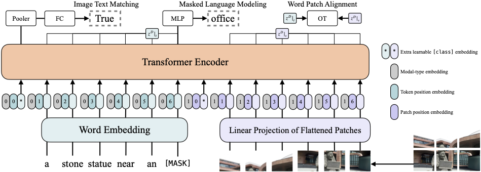

# VILT

> 文章标题：[ViLT: Vision-and-Language Transformer Without Convolution or Region Supervision](https://arxiv.org/abs/2102.03334) 
>
> 作者：Wonjae Kim, Bokyung Son, Ildoo Kim
>
> 发表时间：(ICML 2021)
>
> [offical code](https://github.com/dandelin/vilt) 
>
> 第一个摆脱了目标检测的视觉文本模型

## Abstract

Vision and Language Pre-training(VLP) 当前的工作主要集中在图像特征抽取上，一般来讲，图像特征抽取的越好，下游任务中的表现就越好。

> * 效率太低，速度太慢，抽取图像特征花费大量时间，比多模态融合都多。
>
> * 用一个预训练好的模型去抽取特征，表达能力受限。
>
>   > 目标检测数据集不够大，规模不够大。如果模型不是端到端学习，只是从预训练模型抽取特征，大概率来说不是最优解。

## Relate work

    
     
    
Four categories of vision-and-language models
    

> 第一类，代表作VSE，文本端较为简单，图像比较贵，融合端也是简单的神经网络。
>
> 第二类，代表作CLIP，图像和文本的计算力度等价，融合的时候将两种特征直接点乘，非常轻量。
>
> 第三类，代表作ViLBERT、UNITER占据了大部分工作，文本端非常轻量。图像端使用目标检测的系统，非常贵。融合端也使用了Transformer，相当于两个大模型。
>
> 第四类，代表作ViLT，基于ViT对图像使用patch embedding，模态融合部分做得比较大。

<table border="0">
    <tr>
        <td align="center"></td>
        <td align="center"></td>
    </tr>
    <tr>
        <td colspan="2" align="center" style="color:black; border-bottrm: 1px solid #d9d9d9;
              padding: 2px;">Visual comparison of conventional VLP architectures and  ViLT</td>
    </tr>
</table>

**模态融合**方法

> signal-stream approach：将两种特征拼接起来，用一个模型处理两个输入。
>
> dual-stream approach：两个模型分别对两种模态信息进行处理，充分挖掘每种模态包含的信息，然后再融合。

两种模型表现差不多，但是dual-stream approach参数多一些，VILT 采用signal-stream approaches。

**文本编码端**都是用预训练的BERT里的tokenizer

**视觉编码端**

> * **Region Feature**：经过一个Backbone抽取特征，然后经过RPN网络生成proposal，经过非极大值抑制 NMS 筛选边界框，最后经过ROI head得到图像序列。把一张图像变成了**离散**的bound-box，每个边界框内都含有明确的类别语义信息。(目标检测)
>
> * **Grid Feature**：仅基于Backbone
>
> * **Patch Projection**：基于 ViT 直接将图像打成patch，，得到一个**有语义信息的离散的序列**。
>

VILT 把模态的特征抽取做到了极小化，主要计算量在模态融合部分，提高模型推理速度。移除了Region feature 

## Methods

文本端有$L$个长为$H$ 的序列，$L$为一个句子中单词数量，$H$为序列长度。

图像端图像被打成 $N $个patch，每个patch也对应长为$H$的序列。

Modal-type embedding 模态信息（文本为0，图像为1），Token position embedding 文本位置信息，Patch position embedding 图像位置信息。

Modal-type embedding +  position embedding + word embedding 不是拼接，是加在一起

Transformer Encoder的输入为$（N+L+2)\times H$的矩阵。* 代表 [CLS] token，$（N+L+2)\times H$中2代表两种模态的[CLS]。

使用了两个loss，分别是**Image Text Matching**和**Mask Laguage Modeling**。加个小loss ：**Word Patch Alignment** 

> Image Text Matching：文字，图片配对 （文本与图像是否匹配）
>
> Mask Laguage Modeling：NLP的完形填空
>
> Word Patch Alignment ：利用最优运输理论计算相似度（分布距离）

Transformer 的输出为$1\times H$的矩阵，经过$H\times H$的pooler(权重矩阵)得到仍是$1\times H$的矩阵，最后经过一个FC层进行二分类任务。

### Whole word masking

例如giraffe长颈鹿这个单词，由三个词根组成，分别是gi，raf，fe，如果mask 的时候mask “raf”这个token。由于开头为gi结尾为fe的单词不多，模型就记住了中间一定是raf，就相当于模型学到了shortcut，这样泛化性就不好。

直接mask “giraffe” 整个单词。这样就需要借助图像信息，因此就加强了图像文本的联系。

### Image Augmentation

> 为什么前边的研究没有使用数据增强？
>
> > 多模态学习要考虑图像文本匹配的问题，数据增强可能会改变图像语义
> > 使用预训练模型，无法进行数据增强

不适用color inversion和cutout避免与文本信息不匹配。

## Experiments

预训练所用的数据集叫4million(4个数据集图片加起来这个数)

> MSCOCO：113K图片 567K 长标题
> VG： 108K图片 5.41M 短标题
> GCC：3.01M图片对
> SBU：867K图片对

## Future work

**scalability**：transformer都是越大越好，数据集越大越好（做的更大）

> [Align before Fuse: Vision and Language Representation Learning with Momentum Distillation](https://arxiv.org/abs/2107.07651) 用14million

**Masked Modeling for Visual Inputs**：图像重建 (NLP里进行Mask重建，图像肯定也有用)

> 

**Augmentation Strategies**：数据增强

> [MixGen: A New Multi-Modal Data Augmentation](https://arxiv.org/abs/2206.08358)

## 推荐阅读

[ViLT 论文精读](https://www.bilibili.com/video/BV14r4y1j74y/?spm_id_from=333.788&vd_source=d28e92983881d85b633a5acf8e46efaa)

后续改进，时间提升，更少时间训练

> [Align before Fuse: Vision and Language Representation Learning with Momentum Distillation](https://arxiv.org/abs/2107.07651) 单机8卡训练2-3天
> [BLIP: Bootstrapping Language-Image Pre-training for Unified Vision-Language Understanding and Generation](https://arxiv.org/abs/2201.12086)
> [Masked Unsupervised Self-training for Zero-shot Image Classification](https://arxiv.org/abs/2206.02967)