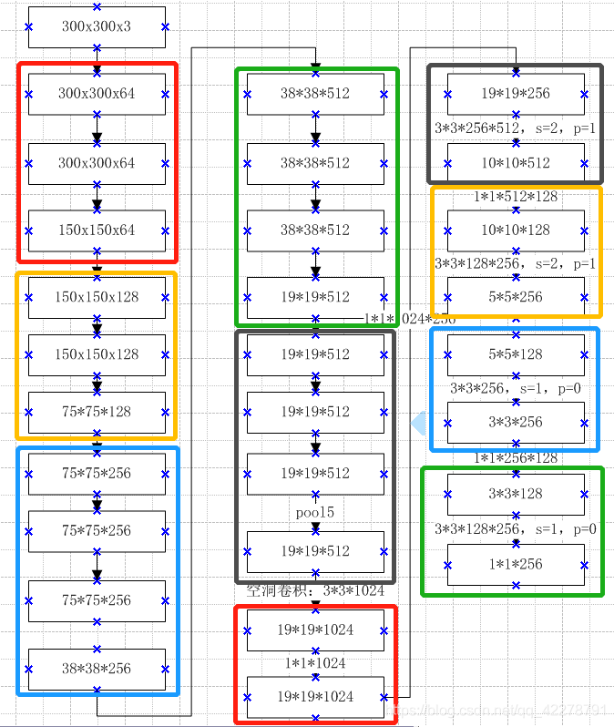
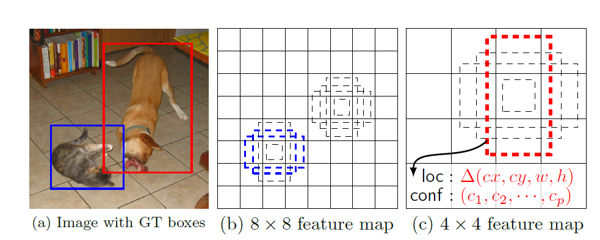

## SSD

> 文章标题：[SSD: Single Shot MultiBox Detector](https://arxiv.org/abs/1512.02325)
> 作者：Wei Liu, Dragomir Anguelov, Dumitru Erhan, Christian Szegedy
> 发表时间：(ECCV 2016)

### 论文结构

**==Abstract：==**

> 1. **提出了SSD目标检测算法：**
>    基于端对端学习的目标检测
>    将边界框的输出空间离散化为一组默认框
>    预测结果来自于不同层次的特征图
>
> 2. **介绍了SSD的性能：**
>    300\*300分辨率的输入，VOC2007测试集上获得74.3%mAP和59FPS
>    512\*512分辨率的输入，获得76.9%mAP，超过了最先进的Faster Rcnn

**==Introduction：==**介绍了当前目标检测的常用方法;介绍了当前目标检测方法的缺点;.简单介绍了SSD的改进,成果和贡献。

> Our improvements include using a small convolutional filter to predict object categories and offsets in bounding box locations, using separate predictors (filters) for different aspect ratio detections, and applying these filters to multiple feature maps from the later stages of a network in order to perform detection at multiple scales.

SSD的改进：

1. 不需要预先提出候选框

2. 不需要像素或者特征的重采样

3. 采用了多尺度的fliters

4. 在多个特征图上预测

SSD的贡献：

1. SSD 方法的核心是使用小卷积滤波器来预测特征图上固定的一组默认边界框的类别分数和位置偏移。

2. 为了实现高检测精度，我们从不同尺度的特征图产生不同尺度的预测，并且通过宽高比来明确地分离预测。

3. 总之，这些设计特性得到了简单的端到端训练和高精度，进一步提高速度和精度的权衡，即使输入相对低分辨率图像。

**==The Single Shot Detector (SSD)：==**

* **Model:**

  算法流程：

  1. 输入一张图片，经过CNN提取特征，并生成feautre map;

  2. 抽取其中六层feautre map,然后在feautre map的每个点生成default box;

  3. 将生成的default box所有集合，丢到NMS(非极大值抑制)中，输出筛选后的default box。

 

SSD网络

​     说明：==Classifier：Conv：3×3×4×（Classes+4)：==3×3卷积核，4boxes,classes类别，4 offsets.

 

SSD网络

  * Multi-scale feature maps for detection多尺度特征图检测

    > 在基础网络(VGG16)结构后，添加了额外的卷积层，这些卷积层的大小是逐层递减的，可以在多尺度下进行 predictions。

  * Convolutional predictors for detection检测的卷积预测器

    > 每个添加的特征层（或可选的基础网络的现有特征层）可以使用一组卷积滤波器产生固定的预测集合。对于具有p 个通道的大小为m×n 的特征层，使用3×3×p 卷积核卷积操作，产生类别的分数或相对于默认框的坐标偏移。在每个应用卷积核运算的m×n 大小位置处，产生一个输出值。边界框相对于默认框测量的偏移输出值。

* Default boxes and aspect ratios默认框与宽高比

  > 将一组默认边界框与顶层网络每个特征图单元关联。默认框对特征图作卷积运算，使得每个框实例相对于其对应单元格的位置是固定的。在每个特征映射单元中，我们预测相对于单元格中的默认框形状的偏移，以及每个框中实例的每类分数。具体来说，对于在给定位置的k 个框中每个框，我们计算c 类分数(位置和置信度）和相对于原始默认框的4 个偏移量。于是，在 feature map 中的每一个 feature map cell 上，就需要有$ (c+4)\times k$ 个 filters。对于一张$ m×n$大小的 feature map，即会产生$(c+4)\times k\times m\times n$ 个输出结果。

 

默认框与宽高比

feature map cell 就是将 feature map 切分成 8×8 或者 4×4 之后的一个格子；
而 default box 就是每一个格子上，一系列固定大小的 box，即图中虚线所形成的一系列 boxes。

* **Training**

  * Matching strateg匹配策略

    > ([MutiBox](https://arxiv.org/abs/1312.2249) )：the best jaccard overlap(**IOU**)匹配每一个ground truth box 和 default box. 
    >
    > 与MutiBox不同的是：只要 jaccard overlap(**IOU**)大于一个threshold阈值(0.5)即配对成功。
    >
    > Why：使得有多个重叠默认框时网络预测获得高置信度，不单单只找匹配度做高的框。

  * Training objective

    > $x^p_{ij}=\{1，0\}$；第$i$个default box与类别$p$的第$j$个ground truth box相匹配时值为1。
    >
    > 根据匹配策略，必有$\sum_i x^p_{ij}\geq1$。
    >
    > objective loss function总体目标损失函数是位置损失（loc）和置信损失（conf）的加权和： :$L(x,c,l,g)=\frac{1}{N}(L_{conf}(x,c)+\alpha L_{loc}(x,l,g))$
    >
    > > N是与ground truth box相匹配的default boxes的个数
    > >
    > > $L_{loc}$是类似于Fast RCNN 的预测框(l)和真实标签值框(g)参数之间的Smooth L1 loss.
    > >
    > > $L_{conf}$置信损失是softmax 损失对多类别置信$(c)$和权重项$\alpha$设置为1 的交叉验证。

  * Choosing scales and aspect ratios for default boxes选择默认框的比例和宽高比

    > 越底层的layers，保留的图像细节越多。
    >
    > lower and upper feature maps for detection.
    >
    > $s_k=s_{min}+\frac{s_{max}-s_{min}}{m-1}(k-1), \ k\in[1,m]$
    >
    > > $s_k$为每一个特征图中默认框尺寸大小，m 为feature maps，其中$s_{min}$ 是0.2，$s_{max}$ 是0.95，意味着最低层具有0.2 的刻度，最高层具有0.95 的刻度，并且其间的所有层是规则间隔的。
    >
    >  宽高比$a _r=\{1,2,3,\frac{1}{2},\frac{1}{3}\}$；width：$w^a_k=s_k\sqrt a_r$；height：$h^a_k=s_k/\sqrt a_r$
    >
    > > 当$a_r$为1时，增加一个默认框，$s'_k=\sqrt{s_ks_{k+1}}$。每个feature map location有6个默认框。
    >
    > 每个default box的中心：$(\frac{i+0.5}{\|f_k|},\frac{j+0.5}{\|f_k|})$ ，$|f_k|$为第k个feature map的大小，$i,j\in[0,|f_k|]$

  * Hard negative mining

    > 生成的预测框负样本Negative boxes远多于Positive boxes.（不平衡，训练难以收敛）
    >
    > 解决方案：每个默认框的最高置信度对它们进行排序，并选择前面的那些，使得正负样本之间的比率最多为3：1，以代替使用所有的负样本。

  * Data augmentation数据增广

**==Experimental Results：==**

* PASCAL VOC2007
* Model analysis
* PASCAL VOC2012
* COCO
* Preliminary ILSVRC results
* Data Augmentation for Small Object Accuracy
* Inference time

**==Related Work：==**

**==Conclusions：==**

**==Acknowledgment：==**

