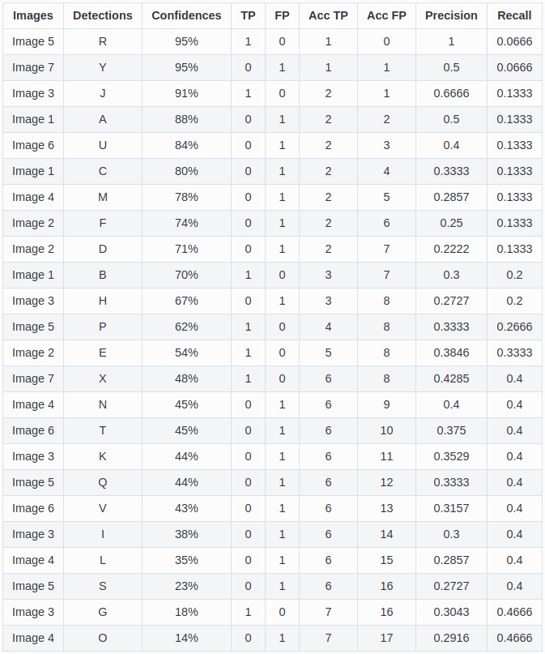
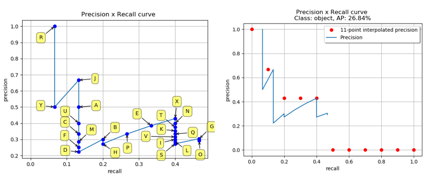

# 目标检测评价指标

> https://github.com/rafaelpadilla/Object-Detection-Metrics#different-comprtitions-different-merics
>
> https://bbs.cvmart.net/articles/4992

[toc]

## mAP:平均准确率  

### IOU交并比

<center>

<br>
<div style="color:orange; border-bottom: 1px solid #d9d9d9;
display: inline-block;
color: #999;
padding: 2px;">IOU</div>
</center>


### 准确率 – precision & 召回率 – recall

1. **True Positive (TP)**: A correct detection. Detection with IOU ≥ _threshold_  

2. **False Positive (FP)**: A wrong detection. Detection with IOU < _threshold_  

3. **False Negative (FN)**: A ground truth not detected  

4. **True Negative (TN)**: Does not apply.

​    第二个字母，即它是你认为该样本的归属应该是怎样（Positive or Negative）；第一个字母即是对你的判断进行的评价（False or True）。

若一个待检测的物体为狗，我们将被正确识别的狗，即检测为狗实际也为狗，称为True positives。将被正确识别的猫，即检测为猫实际也为猫，称为True negatives。被错误识别为狗的猫称为 False positives，被错误识别为猫的狗称为 False negatives。
则 precision 的计算为：
$$
precison=\frac{TP}{TP+FP}=\frac{TP}{all\ detections}
$$
准确率可以反映一个类别的预测正确率
recall 的计算为：
$$
recall=\frac{TP}{TP+FN}=\frac{TP}{all\ ground\ truths}
$$


### 精确度 – accuracy

精确度就是在所有预测的样本中，识别正确的占了多少。
$$
accuracy=\frac{TP+TN}{TP+FN+TN+FP}
$$

### 计算AP

<center>

<br>
<div style="color:orange; border-bottom: 1px solid #d9d9d9;
display: inline-block;
color: #999;
padding: 2px;">举例1</div>
</center>

有7个图像，其中15个ground truth objects由绿色边界框表示，24个检测到的对象有红色边界框表示，每个检测到的对象由字母(A,B,...,Y)标识，且具有confidence。

<center>

<br>
<div style="color:orange; border-bottom: 1px solid #d9d9d9;
display: inline-block;
color: #999;
padding: 2px;">图片信息统计</div>
</center>


利用confidence给BBOX排序，给每一个BBOX计算对应的precision和recall值。

例如：对BBOX R， precision = 1/1=1, recall = 1/15 = 0.0666

​           对BBOX Y， precision = 1/2=0.5, recall = 1/15 = 0.0666

​           对BBOX J， precision = 2/3=0.6666, recall = 2/15 = 0.1333

<center>

<br>
<div style="color:orange; border-bottom: 1px solid #d9d9d9;
display: inline-block;
color: #999;
padding: 2px;">排序并计算</div>
</center>

#### 11-point interpolation


$$
\rho_{\text{interp}} = \max_{\tilde{r}:\tilde{r} \geq r} \rho\left ( \tilde{r} \right )
$$

$$
\begin{aligned}
{AP}&=\frac{1}{11} \sum_{r\in \left \{ 0, 0.1, ...,1 \right \}}\rho_{\text{interp}\left ( r \right )} \\
&=\frac{1}{11}(1+0.6666+0.4285+0.4285+0.4285+0+0+0+0+0+0)\\
&=26.84\%
\end{aligned}
$$


<center>

<br>
<div style="color:orange; border-bottom: 1px solid #d9d9d9;
display: inline-block;
color: #999;
padding: 2px;">11点插值法</div>
</center>


#### Interpolating all points

$$
\sum_{n=0} \left ( r_{n+1} - r_{n} \right ) \rho_{\text{interp}}\left ( r_{n+1} \right )\\
\rho_{\text{interp}}\left ( r_{n+1} \right ) = \max_{\tilde{r}:\tilde{r} \ge r_{n+1}} \rho \left ( \tilde{r} \right )
$$

$$
\begin{aligned}
{AP}&=A1+A2+A3+A4\\
&=0.0666+0.04446222+0.11428095+0.02026638\\
&=24.56\%
\end{aligned}
$$

<center>

<br>
<div style="color:orange; border-bottom: 1px solid #d9d9d9;
display: inline-block;
color: #999;
padding: 2px;">11点插值法</div>
</center>

```python
import numpy as np

def voc_ap(rec, prec, use_07_metric=False):
    """ ap = voc_ap(rec, prec, [use_07_metric])
    Compute VOC AP given precision and recall.
    If use_07_metric is true, uses the
    VOC 07 11 point method (default:False).
    """
    # 针对2007年VOC，使用的11个点计算AP，现在不使用
    if use_07_metric:
        # 11 point metric
        ap = 0.
        for t in np.arange(0., 1.1, 0.1):
            if np.sum(rec >= t) == 0:
                p = 0
            else:
                p = np.max(prec[rec >= t])
            ap = ap + p / 11.
    else:
        # correct AP calculation
        # first append sentinel values at the end
        mrec = np.concatenate(([0.], rec, [1.]))  #[0.  0.0666, 0.1333, 0.4   , 0.4666,  1.] 
        mpre = np.concatenate(([0.], prec, [0.])) #[0.  1.,     0.6666, 0.4285, 0.3043,  0.]

        # compute the precision envelope
        # 计算出precision的各个断点(折线点)
        for i in range(mpre.size - 1, 0, -1):
            mpre[i - 1] = np.maximum(mpre[i - 1], mpre[i])  #[1.     1.     0.6666 0.4285 0.3043 0.    ]

        # to calculate area under PR curve, look for points
        # where X axis (recall) changes value
        i = np.where(mrec[1:] != mrec[:-1])[0]  #precision前后两个值不一样的点
        print(mrec[1:], mrec[:-1])
        print(i) #[0, 1, 3, 4, 5]

        # AP= AP1 + AP2+ AP3+ AP4
        ap = np.sum((mrec[i + 1] - mrec[i]) * mpre[i + 1])
    return ap

rec = np.array([0.0666, 0.1333,0.1333, 0.4, 0.4666])
prec = np.array([1., 0.6666, 0.6666, 0.4285, 0.3043])
ap = voc_ap(rec, prec)

print(ap) #输出：0.2456

```


### mAP的计算

最终根据每个类别的AP求和之后除以总的检测类别数目就得到mAP(mean Average Precision)。

```python
from voc_eval import voc_eval
import os

mAP = []
# 计算每个类别的AP
for i in range(8):
    class_name = str(i)  # 这里的类别名称为0,1,2,3,4,5,6,7
    rec, prec, ap = voc_eval('path/{}.txt', 'path/Annotations/{}.xml', 'path/test.txt', class_name, './')
    print("{} :\t {} ".format(class_name, ap))
    mAP.append(ap)

mAP = tuple(mAP)

print("***************************")
# 输出总的mAP
print("mAP :\t {}".format( float( sum(mAP)/len(mAP)) ))

```


## 置信度

置信度confidence指的是一个边界框包含某个物体的可能性大小以及位置的准确性（即是否恰好包裹这个物体）。Pr(object)是bounding box内存在对象的概率。Pr(object)并不管是哪个对象，它表示的是有或没有对象的概率。如果有object落在一个grid cell里，第一项取1，否则取0。第二项是预测的bounding box和实际的groundtruth之间的IoU值。其中IOU表示了预测的bbox与真实bbox（GT）的接近程度。置信度高表示这里存在一个对象且位置比较准确，置信度低表示可能没有对象或即便有对象也存在较大的位置偏差。
$$
Confidence=Pr(Object)*IOU^{truth}_{pred}
$$
20个对象分类的概率是$P(Class_i|Object)$。表示已经有一个对象在网格中了，这个对象具体是哪一个。