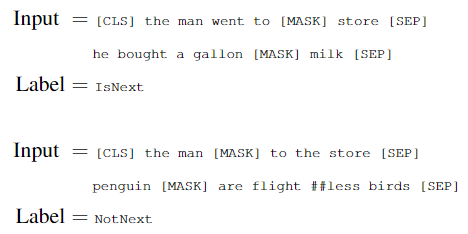

# BERT

> 文章标题：[BERT: Pre-training of Deep Bidirectional Transformers for Language Understanding](https://arxiv.org/abs/1810.04805)
> 作者：Jacob Devlin, Ming-Wei Chang, Kenton Lee, Kristina Toutanova
> 发表时间：(NAACL-HLT 2019)
>
> [官方代码](https://github.com/google-research/bert)
>
> ==Transformer一统NLP的开始==

BERT: 用深的、双向的、transformer 来做预训练，用来做语言理解的任务。 

> pre-training: 在一个大的数据集上训练好一个模型 pre-training，模型的主要任务是用在其它任务 training 上
>
> deep bidirectional transformers: 深的双向 transformers
>
> language understanding: 更广义，transformer 主要用在机器翻译 MT

## Abstract

新的语言表征模型 BERT: **B**idirectional **E**ncoder **R**epresentations from **T**ransformers 

> 

>  src="BERT.assets/Elmo_GPT_Bert.png"  >
>  
> 
 display: inline-block;
> color: #999;
> padding: 2px;">Elmo_GPT_Bert

> 

>
> [ELMo](https://arxiv.org/abs/1802.05365v2)：使用左右侧的上下文信息 ；基于RNN，应用下游任务需要一点点调整架构
>
> GPT：使用左边的上下文信息，预测未来 
>
> BERT：使用左右侧的上下文信息 ；基于Transformer，应用下游任务只需要调整最上层
>
> > 从无标注的文本中（jointly conditioning 联合左右的上下文信息）预训练得到无标注文本的 deep bidirectional representations 
> >
> > BERT = ELMo 的 bidirectional 信息 + GPT 的新架构 transformer

## Introduction

NLP任务分两类

> sentence-level tasks ：句子情绪识别、两个句子的关系；
>
>  token-level tasks  ：NER (人名、街道名) 需要 fine-grained output

BERT训练方法

>  通过 MLM 带掩码的语言模型作为预训练的目标，来减轻语言模型的单向约束。inspired by the Close task 1953 
>
> **MLM ** (masked language model)：每次随机选输入的词源 tokens, 然后 mask 它们，目标函数是预测被 masked 的词；15%的词汇mask
>
> > > 假设输入里面的第二个词汇是被盖住的，把其对应的embedding输入到一个多分类模型中，来预测被盖住的单词。类似挖空填词、完形填空
> >
> >  standard language model：只看左边的信息
>
>  **NSP**: (next sentence prediction )：预测下一个句子；判断两个句子是随机采样的 or 原文相邻，学习sentence-level 的信息。 
>
> > 把两句话连起来，中间加一个[SEP]作为两个句子的分隔符。而在两个句子的开头，放一个[CLS]标志符，将其得到的embedding输入到二分类的模型，输出两个句子是不是接在一起的。

在训练BERT的时候，这两个任务是同时训练的。所以，BERT的损失函数是把这两个任务的损失函数加起来的，是一个**「多任务」**训练

贡献

> bidirectional 双向信息的重要性
>
> BERT 首个微调模型，在 sentence-level and token-level task效果好
>
> 好的预训练模型，不用对特定任务做一些模型架构的改动

## Related Work

Unsupervised Feature-based approaches

> 非监督的基于特征表示的工作：词嵌入、ELMo等

Unsupervised Fine-tuning approaches

>  非监督的基于微调的工作：GPT等

Transfer Learning from Supervised Data

> 在有标签的数据上做迁移学习。

## Bert

**预训练 + 微调** 

 

bert_stage

> pre-training：使用 unlabeled data 训练 
>
> fine-tuning：微调的 BERT 使用预训练的参数 初始化，所有的权重参数通过下游任务的 labeled data 进行微调。
>
> 每一个下游任务会创建一个 新的 BERT 模型，（由预训练参数初始化），但每一个下游任务会根据自己任务的labeled data 来微调自己的 BERT 模型。 

|  model name   |  L   |  H   |  A   | Total Parameters |
| :-----------: | :--: | :--: | :--: | :--------------: |
| $BERT_{base}$ |  12  | 768  |  12  |       110M       |
| $BERT_{base}$ |  24  | 1024 |  16  |       340M       |

> L：transform blocks的个数
> H：hidden size 隐藏层大小
> A：自注意力机制 multi-head 中 head 头的个数

BERT 模型复杂度和层数 L 是 linear, 和宽度 H 是 平方关系。
深度变成了以前的两倍，在宽度上面也选择一个值，使得这个增加的平方大概是之前的两倍。

> $H_{large}=\sqrt {2} H_{base}=\sqrt 2 \times 768=1086$

H = 16，因为每个 head 的维度都固定在了64。所以宽度增加了， head 数也增加了

>$H = 64 \times A:\ \ 768=64\times 12;\ \ 1024=64\times 16$

嵌入层：输入字典大小30k，输出H

transformer blocks($H^2\times 12$)：self-attention($H^2\times 4$) + MLP  ($H^2\times 8$)

> Transformer block:
>
> > 多头Q,K,V投影矩阵合并$H(64\times A)$+输出后再H*H投影
>
> MLP 的 2个全连接层：
>
> > 第一个全连接层输入是 H，输出是 4 * H；
> > 第二个全 连接层输入是 4 * H，输出是 H。

$Total \ Parameters = 30K\times H + 12 \times H^2 \times L$

> $BERT_{base} = 30000\times 768 + 12 \times 768^2 \times 12 = 107.97M$
>
> $BERT_{large} = 30000\times 1024+ 12 \times 1024^2\times 24= 332.71M$

### Input/Output Representation(预训练&微调共通部分）

BERT 的输入和 transformer 区别

> transformer 预训练时候的输入是一个序列对。编码器和解码器分别会输入一个序列。
> BERT 只有一个编码器，为了使 BERT 能处理两个句子的情况，需要把两个句子并成一个序列。

BERT切词

> WordPiece, 把一个出现概率低的词切开，只保留一个词出现频率高的子序列，30k token 经常出现的词（子
> 序列）的字典。
> 否则，空格切词 --> 一个词是一个 token。数据量打的时候，词典会特别大，到百万级别。可学习的参数基
> 本都在嵌入层了。

BERT 的输入序列构成 [ CLS ] + [ SEP ]

 

输入序列

> Token embeddings: 词源的embedding层，整成的embedding层， 每一个 token 有对应的词向量。
> Segement embeddings: 这个 token 属于第一句话 A还是第二句话 B。
> Position embedding 的输入是 token 词源在这个序列 sequence 中的位置信息。（和Transformer不一样，这是学习出来的）

BERT 的 segment embedding （属于哪个句子）和 position embedding （位置在哪里）是学习得来的，
transformer 的 position embedding 是给定的。

> 序列开始:**[CLS]** 输出的是句子层面的信息 sequence representation
>
> > BERT 使用的是 transformer 的 encoder，self-attention layer 会看输入的每个词和其它所有词的关系。
> > 就算 **[ CLS ]** 这个词放在我的第一个的位置，他也是有办法能看到之后所有的词。所以他放在第一个是没关
> > 系的，不一定要放在最后。
>
> 区分两个合在一起的句子的方法：
>
> > 每个句子后 + **[ SEP ]** 表示 seperate
> > 学一个嵌入层 来表示整个句子是第一句还是第二句

### Pre-training BERT

预训练的 key factors: 目标函数，预训练的数据

#### MLM

由 WordPiece 生成的词源序列中的词源，它有 15% 的概率会随机替换成一个掩码。但是对于特殊的词源不
做替换

> 15% 计划被 masked 的词：80% 的概率被替换为 [MASK], 10% 换成 random token,10% 不改变原 token。
>
> 特殊的词源：第一个词源 [ CLS ] 和中间的分割词源 [SEP]。
>
> 问题：预训练和微调看到的数据不一样
>
> >预训练的输入序列有 15% [MASK]，微调时的数据没有 [MASK].
>
> 为什么要Mask
>
> > 语言模型会根据前面单词来预测下一个单词，但是self-attention的注意力只会放在自己身上，那么这样100%预测到自己，毫无意义，所以用Mask，把需要预测的词给挡住。
>
> Mask方式优缺点：
>
> > 1）被随机选择15%的词当中以10%的概率用任意词替换去预测正确的词，相当于文本纠错任务，为BERT模型赋予了一定的文本纠错能力；
> >
> > 2）被随机选择15%的词当中以10%的概率保持不变，缓解了finetune时候与预训练时候输入不匹配的问题（预训练时候输入句子当中有mask，而finetune时候输入是完整无缺的句子，即为输入不匹配问题）。
> >
> > 3）针对有两个及两个以上连续字组成的词，随机mask字割裂了连续字之间的相关性，使模型不太容易学习到词的语义信息。主要针对这一短板，因此google此后发表了BERT-WWM，国内的哈工大联合讯飞发表了中文版的BERT-WWM。

#### NSP

输入序列有 2 个句子 A 和 B，50% 正例，50%反例

> 50% B 在 A 之后,是一对连续句子，标记为 IsNext；50% 是语料库中 a random sentence 随机采样的，标记为 NotNext。
>
> 
>
> flight ## less：flightless 出现概率不高，WordPiece 分成了 2 个出现频率高的子序列，## 表示 less 是flightless 的一部分。

### Fine-tuning BERT

BERT 经过微小的改造（增加一个小小的层），就可以用于各种各样的语言任务。

（a,b）与 Next Sentence Prediction类似，通过在 **「[CLS]」** 标记的 Transformer 输出顶部添加分类层，完成诸如情感分析之类的**「分类」**任务

（c）在问答任务（例如 SQuAD v1.1）中，会收到一个关于文本序列的问题，并需要在序列中标记答案。使用 BERT，可以通过学习标记答案开始和结束的两个额外向量来训练问答模型。

（d）在命名实体识别 (NER) 中，接收文本序列，并需要标记文本中出现的各种类型的实体（人、组织、日期等）。使用 BERT，可以通过将每个标记的输出向量输入到预测 NER 标签的分类层来训练 NER 模型

 

differernt tasks

## 拓展阅读

[BERT 论文逐段精读【论文精读】](https://www.bilibili.com/video/BV1PL411M7eQ?spm_id_from=333.999.0.0)

[李宏毅：ELMO, BERT, GPT](https://www.youtube.com/watch?v=UYPa347-DdE)

[The Illustrated BERT, ELMo, and co. (How NLP Cracked Transfer Learning)](https://jalammar.github.io/illustrated-bert/)

[BERT 详解（附带 ELMo、GPT 介绍）](https://wmathor.com/index.php/archives/1456/)

[BERT 科普文](https://leemeng.tw/attack_on_bert_transfer_learning_in_nlp.html)

[作者对双向的回应](https://www.reddit.com/r/MachineLearning/comments/9nfqxz/r_bert_pretraining_of_deep_bidirectional/)

[ACL 2019：What does BERT learn about the structure of language?](https://hal.inria.fr/hal-02131630/document)：BERT的低层网络就学习到了短语级别的信息表征，BERT的中层网络就学习到了丰富的语言学特征，而BERT的高层网络则学习到了丰富的语义信息特征

[BERT Rediscovers the Classical NLP Pipeline](https://arxiv.org/abs/1905.05950)

[关于BERT：你不知道的事](https://mp.weixin.qq.com/s/cDG7DwHFL1kHErwyYGT4UA)
